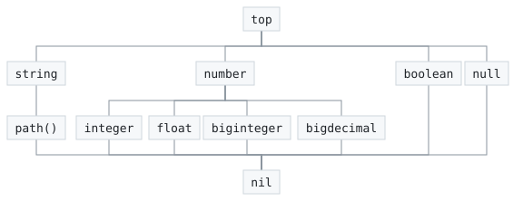
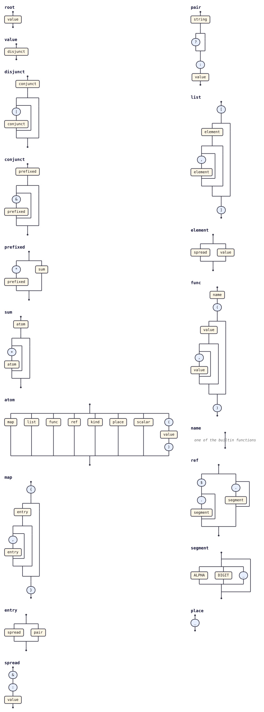
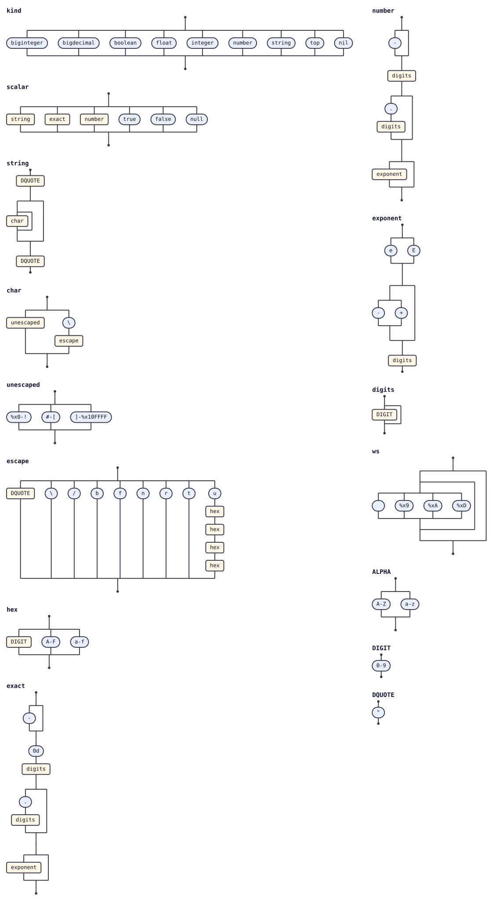

# Language reference

Complete, exhaustive description of the aontu core language: lexical
structure, every value form and operator, evaluation order, and the
canonical form. Behaviour stated here is verified by the shared
[`test/spec/*.tsv`](../test/spec/) suite and holds in both the
TypeScript and Go implementations unless a difference is called out.

For every built-in function, with its signature and its behaviour, see
the [Functions reference](reference-functions.md). For the generators,
the selectors and the rules `generate` follows see the
[Generation reference](reference-generation.md). For the public
programming interface see the [API reference](reference-api.md). For
the reasoning behind the model see the [Explanation](explanation.md).

## Contents

- [Lexical structure](#lexical-structure)
- [The value lattice](#the-value-lattice)
- [Scalars](#scalars)
- [Scalar kinds (types)](#scalar-kinds-types)
- [Maps](#maps)
- [Lists](#lists)
- [Container kinds: `map()` and `list()`](#container-kinds-map-and-list)
- [Conjunction `&`](#conjunction-)
- [Disjunction `|`](#disjunction-)
- [Preference / default `*`](#preference--default-)
- [Optional keys `?`](#optional-keys-)
- [Spreads `&:`](#spreads-)
- [References and paths](#references-and-paths)
  - [Recursive references (fixpoints)](#recursive-references-fixpoints)
- [Variables `$name`](#variables-name)
- [Aliases `%`](#aliases-)
- [The `+` operator and grouping](#the--operator-and-grouping)
- [Linking: the tree is the namespace](#linking-the-tree-is-the-namespace)
- [Marks: `type` and `hide`](#marks-type-and-hide)
- [Closed values: `close` / `open`](#closed-values-close--open)
- [Source loading `@"…"`](#source-loading-)
  - [Text: `.txt` and `--text-ext`](#text-txt-and---text-ext)
- [Operator precedence](#operator-precedence)
- [Canonical form](#canonical-form)
- [The formatted form](#the-formatted-form)
- [The published grammar](#the-published-grammar)
- [Subsumption](#subsumption)
- [Errors](#errors)

---

## Lexical structure

aontu source is parsed by
[`@tabnas/jsonic`](https://github.com/tabnas/jsonic) with aontu-specific
plugins, so the surface syntax is "relaxed JSON".

- **Whitespace** separates tokens; newlines and commas are
  interchangeable separators. `a:1 b:2`, `a:1, b:2`, and `a:1\nb:2` are
  equivalent.
- **Comments** begin with `#` and run to end of line. A file of only
  comments unifies to `{}`.
- **Bare strings** need no quotes (`name: Mercury`), and may hold
  letters, digits, `-` and `_`, and nothing else. So `owner:
  team-payments`, `on: 2026-09-05` and `id: user_42` are bare strings.
  Every other punctuation character is either syntax, where the
  grammar gives it a meaning, or an error where it does not: `x=y`,
  `6/2`, `50%` and `>10` are refused with `[aontu/bare_punct]`, which
  names the character, rather than read as strings. Quote with `"…"`,
  `'…'` or `` `…` `` to include spaces or any other character
  (`name: "hi there"`, `ratio: "6/2"`). All three are the same kind of
  value; only what they may contain differs.
- **Keys** follow the same rule: bare when they hold only letters,
  digits, `-` and `_` (`host`, `a-b`), quoted otherwise.
- **Backtick strings may span lines.** `"…"` and `'…'` refuse a
  literal newline; `` `…` `` accepts one, so a backtick string carries
  several lines of text as one scalar. This is what lets a document hold a
  block of another language: a shell script, a template, a fragment
  of generated source. Escapes are processed in all three forms, so
  `\t` is a tab and `` \` `` is a literal backtick. A **literal**
  control character in the source is refused
  (`[aontu/unprintable]`), including a literal tab: write `\t`.
- **Numbers** come in two families. A plain JSON number (`1`, `1.5`,
  `1e3`) is stored as an IEEE-754 double and takes `integer` or
  `float` kind; a `0d`-prefixed literal (`0d5`, `0d0.1`) is stored
  *exactly*, with no binary rounding anywhere, and takes `biginteger`
  or `bigdecimal` kind. Which of the four a literal takes is decided
  by its source text, never by its magnitude; the rule is stated in
  full under [Scalar kinds](#scalar-kinds-types).
- **Exact literals** are written `0d` (or `0D`) followed by digits.
  Digits alone give a biginteger (`0d123`); adding a `.` or an
  exponent gives a bigdecimal (`0d0.1`, `0d1e3`). The grammar is
  `0[dD] digits [ "." digits ] [ (e|E) [+-] digits ]`. The sign goes
  *before* the prefix (`-0d5`, never `0d-5`) and a marker with no
  digit after it is not a literal at all: `0d` is the bare string
  `"0d"`, and `0d.5` reads as member access on that string.
- **Other numeric forms.** Hexadecimal (`0x1f`), octal (`0o17`) and
  binary (`0b1010`) literals use lower-case prefixes, and belong to
  the plain family, not the exact one. (Only the exact marker also
  accepts its letter in upper case: `0D12` is a literal, `0X1F` is the
  bare string `"0X1F"`.) `_` may separate digits (`1_000_000`,
  `0d1_000`), but only singly and only *between* digits: a run that
  breaks the rule is not a number at all, so `1__0` is the string
  `"1__0"`, not `10`.
- **A number that cannot be stored exactly is refused.** An integer
  literal the double format would silently round is a located error
  naming the `0d` escape, not an approximation: see
  [Exact or refused](#exact-or-refused-lossy-literals).
- **Booleans** are `true` / `false`; **null** is `null`.

A backtick string is how a document holds a block of another
language. Here `greet.aon` carries a shell script as one value:

<!-- test: scenario backtick-multiline -->
<!-- test: file greet.aon -->
```aon
greet: `#!/bin/sh
echo "hi"
`
tab: `x\ty`
```

<!-- test: run -->
```sh
$ aontu -c greet.aon
{"greet":"#!/bin/sh\necho \"hi\"\n","tab":"x\ty"}
$ echo $?
0
```

The relaxed forms combine in one document:

```aon
a: 1
b: 2
c: Mercury
d: "hi there"
```

```json
{"a":1,"b":2,"c":"Mercury","d":"hi there"}
```

## The value lattice

Every aontu value is a point in a lattice ordered from most general to
most specific:



The engine draws this figure itself: it is
[`aontu view lattice`](reference-api.md#aontu-view) over a document
with no values in it. Run the same verb over your own document and
each node carries a count of the values that landed there.

- **`top`** is the unit: unifying anything with `top` yields the other
  value. It is what an unconstrained field is.
- **`nil`** (bottom) is the result of a failed unification. It carries an
  error message and cannot be generated.
- **Unification** of two values is their *greatest lower bound*: the
  most general value at least as specific as both. If none exists, the
  result is `nil`.

This ordering is why unification is order-independent and idempotent:
`a & b` equals `b & a`, and `a & a` equals `a`.

## Scalars

| Form        | Example source | Generates |
|-------------|----------------|-----------|
| integer     | `a:1`          | `1`       |
| negative    | `a:-5`         | `-5`      |
| float       | `a:1.5`        | `1.5`     |
| biginteger  | `a:0d5`        | `5`       |
| bigdecimal  | `a:0d0.1`      | `0.1`     |
| bare string | `a:hello`      | `"hello"` |
| quoted str  | `a:"hi there"` | `"hi there"` |
| boolean     | `a:true`       | `true`    |
| null        | `a:null`       | `null`    |

Two scalars unify only if they are of the same kind *and* equal
(`1 & 1` → `1`, `foo & foo` → `"foo"`); otherwise the result is a
conflict (`1 & 2` → error, and so is `1 & 1.0`).

## Scalar kinds (types)

A bare kind name is a *type*: the set of all scalars of that kind.

| Kind         | Matches                                        |
|--------------|------------------------------------------------|
| `string`     | any string                                     |
| `number`     | any numeric value: the supertype over the four leaves below |
| `integer`    | any value of *integer kind* (below)            |
| `float`      | any value of *float kind* (below)              |
| `biginteger` | any value of *biginteger kind* (below)         |
| `bigdecimal` | any value of *bigdecimal kind* (below)         |
| `boolean`    | `true` or `false`                              |
| `top`        | any value at all                               |

The path kind is spelled `path()` rather than a bare word, and sits
under `string`: see [First-class
paths](reference-functions.md#first-class-paths-pathp). The container
kinds are `map()` and `list()`: see [Container
kinds](#container-kinds-map-and-list).

### The four numeric leaves

Every numeric value carries a **kind**, fixed when the value is built,
and it is the kind (not the magnitude) that decides what the value
unifies with. There are four numeric kinds, and `number` is not one of
them: `number` names the whole family and nothing else, so no value
ever has `number` kind.

```
number                   (a pure supertype — no value has this kind)
├── integer      a double, whole, in the int64 window   1     1e3
├── float        any other double                       1.5   1e21
├── biginteger   exact, whole, unbounded                0d5   0d1_000
└── bigdecimal   exact, with a point or an exponent     0d0.1 0d1e3
```

The two upper leaves hold IEEE-754 doubles (every value a plain JSON
number can hold exactly) and the source rule below decides which of
them a literal joins. The two lower leaves are reached only by writing
`0d`, and hold their digits *exactly*: no binary rounding, and no
precision limit but the [exactness budget](#the-exactness-budget).

The four leaves are **disjoint**. No value belongs to two of them, and
values of different leaves never unify however equal they look: `1 &
1.0`, `5 & 0d5` and `0d5 & 0d5.0` are all conflicts. A cross-leaf result
would have to pick a kind, and either choice would make `&` asymmetric
in kind.

**Leaf by source.** Which leaf a literal lands in is decided by how it
is written, never by how large it is. A literal *without* the `0d`
prefix has **integer** kind if, and only if, all three of these hold:

1. its source text contains no `.`;
2. its value is integral (no fractional part);
3. its value lies within the int64 range, that is
   `-9223372036854775808 ≤ n < 9223372036854775808`.

Anything else has **float** kind. The upper bound is *exclusive*
because these values are doubles and 2^63−1 cannot be represented in
one: it rounds up to 2^63, and so falls outside the range.

A literal *with* the `0d` prefix has **bigdecimal** kind if its source
contains a `.` or an exponent, and **biginteger** kind otherwise.

```
1                      → integer     (no '.', integral, in range)
1e3                    → integer     (1000 — an exponent is not a '.')
9007199254740992       → integer
1.0                    → float       (rule 1: the source has a '.')
1.5                    → float       (rules 1 and 2)
1e21                   → float       (rule 3: beyond int64)
100000000000000000000  → float       (rule 3)
0d5                    → biginteger  (0d, digits only)
0d1_000                → biginteger
0d0.1                  → bigdecimal  (0d with a '.')
0d1e3                  → bigdecimal  (0d with an exponent)
```

The two families nearly mirror each other, with one asymmetry: a `.`
splits the leaf in both, but an exponent splits it only in the `0d`
family: `1e3` is an integer, `0d1e3` a bigdecimal.

**Canon rendering.** Canon renders a number so that reparsing it
yields the same kind again, which takes three markers:

- an integer-kind value renders plainly: `1000`;
- a float-kind value always carries a fraction or an exponent, so
  a `.0` suffix is appended when the shortest rendering has neither:
  `1.0`, `100000000000000000000.0`;
- an exact value carries the `0d` marker, with any sign in front of
  it: `0d5`, `-0d5`, `0d0.1`.

Because `0d` names the *family* and not the leaf, one more marker is
needed to tell the two exact leaves apart, and it is the same `.0`
device: **an integral bigdecimal always renders with one decimal
place.** So `0d1e3` canons as `0d1000.0` while the biginteger `0d1000`
canons as `0d1000`. Without that, `canon(0d1e3)` would reparse as a
biginteger: a different lattice point, since the leaves are disjoint.

Exact values render in plain form at every magnitude, never in
scientific notation, and **one value has exactly one rendering**:
scale is presentation, not identity, so `0d0.10`, `0d0.1` and `0d1e-1`
all parse to the same value and all canon as `0d0.1`.

Edge cases:

- The same rules apply wherever a numeric value is built (a parsed
  literal, a `$var` binding, a raw value handed to the API) so a given
  number never has two different kinds depending on where it came from.
  Where there is no source text, condition 1 is vacuous and conditions
  2 and 3 decide.
- A literal that overflows the double range entirely (`1e999`) is not a
  number at all; it is an error. One that *underflows* to exactly zero
  (`1e-400`) is integer-kind `0`.
- Negative zero never survives, in any leaf: `-0.0` normalises to
  `0.0`, `-0d0` to `0d0`, and `-0d0.0` to `0d0.0`, in canon and in
  generated output alike.
- aontu has no negative literals: `-` is a prefix operator applied to a
  positive literal. The int64 *minimum* therefore cannot be written as
  an integer-kind literal: `-9223372036854775808` negates the
  float-kind literal `9223372036854775808` and stays float kind. Write
  it `-0d9223372036854775808` to hold it exactly, as a biginteger.

### Exact or refused: lossy literals

An integer literal is stored only if the double format holds it
*exactly*. One that would be silently rounded is a located error
instead, and the message names the fix: write it with `0d`.

The input that triggers this rule is ordinary JSON: for example, a
64-bit record ID in a dump from an API. `id: 9007199254740993` is
2^53+1, the first whole number a double cannot hold. Storing it anyway
would yield 9007199254740992, a different ID, with nothing said about
it. aontu refuses:

<!-- test: scenario lossy-literal -->
<!-- test: run -->
```sh
$ echo 'id: 9007199254740993' | aontu
[aontu/lossy_integer_literal]: Cannot resolve value at path $.id

This integer literal, 9007199254740993, is not exactly representable in
binary64, so storing it would silently round it to a DIFFERENT
number. aontu refuses rather than corrupts: write it as a `0d`
literal to get the exact integer.
...
$ echo $?
1
```

(That is the TypeScript wording; Go phrases the same refusal
differently. Both name the `0d` escape.)

Take the escape and the document works again, exactly: in generated
output and in canonical form:

<!-- test: run -->
```sh
$ echo 'id: 0d9007199254740993' | aontu
{
  "id": 9007199254740993
}
$ echo 'id: 0d9007199254740993' | aontu -c
{"id":0d9007199254740993}
```

One consequence to plan for: the rescued value has **biginteger**
kind, not `integer`, so a schema constraining it must say `biginteger`
(or the family, `number`). `id: integer` would now conflict.

```
id:0d9007199254740993 & biginteger   → {"id":0d9007199254740993}
id:0d9007199254740993 & number       → {"id":0d9007199254740993}
id:0d9007199254740993 & integer      → error
```

**The rule is exactness, not magnitude.** A shorter literal can be
refused while a much longer one is fine, because what matters is
whether the exact value happens to be a double:

```
9007199254740992       → integer  (2^53, exactly representable)
9007199254740993       → error    (2^53+1 is not)
100000000000000000000  → float    (10^20 — far larger, still exact)
0x7fffffffffffffff     → error    (2^63−1 rounds up to 2^63)
0x8000000000000000     → float    (2^63 itself is a power of two)
```

The refusal covers every integer-literal form, decimal and
base-prefixed alike, and it happens at parse time, so a lossy literal
never reaches unification.

### The exactness budget

The exact leaves have no precision limit in the ordinary sense (a
biginteger is as wide as its digits) but a bigdecimal is bounded, so
that a short source cannot demand unbounded work. The bound is one a
document can rely on:

> A bigdecimal may carry **at most 4096 coefficient digits** and an
> **absolute scale of at most 4096**.

The *coefficient* is the significant digits with the point removed;
the *scale* is where the point sits among them, which for a literal is
its fraction digits minus its exponent. So `0d1.5e-4095` has
coefficient 2 and scale 4096, and is the last value of its shape that
fits.

Both halves are checked independently, on literals (against the source
as written, before normalisation) and on every computed result.
Exceeding either is a located error: *"This exact decimal exceeds the
exactness budget"*. aontu has no rounding mode and no precision
context, so a value beyond the budget is refused rather than
approximated.

```
0d1e-4096            → 0d0.000…0001   (scale 4096 — inside)
0d1e-4097            → error          (scale 4097 — outside)
0d1e4097             → error          (the bound is two-sided)
0d1e1000000000       → error          (refused before rendering it)
0d1e-4000 + 0d1e4000 → error          (the exact sum needs 8001 digits)
```

`biginteger` has no scale and no coefficient bound: a whole number of
ten thousand digits is an ordinary value.

### Unification rules

- **kind & matching scalar → the scalar.** `number & 2` → `2`;
  `string & hello` → `"hello"`; `1 & integer` → `1`;
  `0d1.5 & bigdecimal` → `0d1.5`.
- **kind & non-matching scalar → conflict.** `1 & string` → error;
  `1.0 & integer` → error (`1.0` is float kind whatever its value),
  and so are `1e21 & integer`, `0d5 & integer` and `1 & biginteger`.
- **kind & kind:** equal kinds unify to themselves; `number & <leaf>` →
  that leaf (`number & integer` → `integer`, `number & bigdecimal` →
  `bigdecimal`); two distinct leaves conflict, as do unrelated kinds.
- **scalar & scalar:** two concrete numbers are the same only when kind
  *and* value match. So `1 & 1.0` is a conflict, and `1|1.0` is a real
  two-branch disjunction: `(1|1.0) & 1.0` selects the float. Value
  comparison for the exact leaves is over the number, not its
  spelling: `0d1.5 & 0d1.50` is `0d1.5`.

No operator or function narrows a kind: see
[`+`](#the--operator-and-grouping) and
[`upper()`/`lower()`](reference-functions.md#functions). The int64
window, the `.0` canon suffix and the `0d` marker are stated in [the
four numeric leaves](#the-four-numeric-leaves) and [Canonical
form](#canonical-form).

## Maps

A map is an unordered set of key/value pairs. Braces are optional at the
top level.

- **Literal:** `a:{b:1,c:2}` → `{"a":{"b":1,"c":2}}`.
-  **Implicit nesting:** a chain of colons builds nested maps: `a:b:c:1`
  → `{"a":{"b":{"c":1}}}`.
- **Duplicate-key merge:** stating a key twice unifies the two values.
  `a:{b:1}, a:{c:2}` → `{"a":{"b":1,"c":2}}`.

The merge recurses through nesting:

<!-- fmt: keep the statements the merge law reads as one map -->
```aon
a: b: c: 1
a: b: d: 2
a: e: 3
```

```json
{"a":{"b":{"c":1,"d":2},"e":3}}
```

Maps are **open** by default (extra keys may be unified in) until sealed
with [`close`](#closed-values-close--open).

## Lists

A list is an ordered sequence.

- **Literal:** `a:[1,2,3]` → `{"a":[1,2,3]}`. Elements may be
  whitespace-separated: `[1 2 3]`.
- **Mixed / nested / of maps:** `[1,two,true]`, `[[1,2],[3,4]]`,
  `[{x:1},{y:2}]` all work.
- **A pair is a single-key map element:** `[a:1, b:2]` is
  `[{a:1}, {b:2}]`: the braces are optional for a one-key map in list
  position, and the two spellings are the same document. An optional
  pair carries its `?` into the element (`[a?:1]` is `[{a?:1}]`), a
  numeric key is a key of the element map and never an index into the
  list (`[0:1]` is `[{"0":1}]`), and a chain nests (`[a:b:1]` is
  `[{a:{b:1}}]`).
- Lists unify element-by-element by position (and support `&:` spreads,
  below).

The pair form reads naturally for ordered records:

```aon
routes: [get:"/health" post:"/orders"]
```

```json
{ "routes": [ { "get": "/health" }, { "post": "/orders" } ] }
```

## Container kinds: `map()` and `list()`

`{}` and `[]` are the container *units*: each admits any value of its
shape, and generates empty when nothing else arrives. `map()` and
`list()` are the container *kinds*: each admits exactly the same
values and defaults to nothing, as `string` does. The kind is the
spelling of "a map must be supplied here": an unmet unit silently
manufactures its empty value, an unmet kind refuses to generate.

```aon
required: map() & { a:1 }
```

```json
{ "required": {"a": 1} }
```

The contrast, unmet:

<!-- test: scenario container-kinds -->
<!-- test: run -->
```sh
$ echo 'y: {}' | aontu -c
{"y":{}}
$ echo 'y: map()' | aontu
[aontu/mapval_no_gen]: Cannot resolve value at path $.y
...
$ echo $?
1
```

A kind mismatch refuses with the unit's own codes (`[aontu/map]`,
`[aontu/list]`): `map() & [1]` is the same fact `{} & [1]` reports.
Neither function takes arguments: element constraints belong to the
spreads (`{&: V}`, `[&: V]`). The kinds settle inside `type()` bodies,
[meet](unification.md) the unit literals (`map() & {}` is `{}`: an
explicitly supplied empty map satisfies the kind), and subsume their
containers (`map()` subsumes `{a:1}`). Pinned by
[`test/spec/containerkind.tsv`](../test/spec/containerkind.tsv).

## Conjunction `&`

`a & b` is the explicit unification of `a` and `b`: the same operation
that merges duplicate map keys.

```aon
a: 1 & integer
b: { x:1 } & { y:2 }
c: { x:p:1 } & { x:q:2 }
```

```json
{"a":1,"b":{"x":1,"y":2},"c":{"x":{"p":1,"q":2}}}
```

Two kinds meet to the narrower kind and stay a kind: `number & integer`
canons as `integer` and does not generate on its own.

Conjunction is commutative, associative, and idempotent. It **distributes
over disjunction**: `x & (a|b)` tries `x` against each alternative.

## Disjunction `|`

`a | b` is a choice of alternatives. It is kept open until something
selects a branch.

```
a:1|2                → canon {"a":1|2}
a:string|number      → canon {"a":string|number}
a:1|2|3              → canon {"a":1|2|3}
```

Unifying a concrete value selects the matching branch (others become nil
and drop out):

```aon
a: 2
a: 1|2
b: 2
b: string|number
```

```json
{"a":2,"b":2}
```

`&` binds tighter than `|`, so `c & b | a` parses as `(c & b) | a`.

**An unresolved disjunction has no value**. More than one alternative
still admitted means the truth is not yet settled, so generation refuses
with `disjunct_no_gen`, class `incomplete`: the same class a bare
`string` residue answers:

```
a:1|2                → [aontu/disjunct_no_gen] at $.a
a:{x:1}|{y:2}        → [aontu/disjunct_no_gen] at $.a
```

Two things resolve it: a value that selects an alternative, or a
preference saying which one holds when nothing else does (below).
Alternatives that are the *same value* collapse first, so `1|1` and
`{a:1}|{a:1}` each generate that one value: sameness is structural
for maps and lists (container kind, closedness, marks, optional keys,
then the children).

An optional key whose value is an unresolved disjunction is dropped
rather than reported, as every other unresolved optional is.

## Preference / default `*`

`*x` marks `x` as **preferred** (a default). In a disjunction the
preferred branch is chosen unless unification forces another.

```aon
a: *1|number
b: *5
c: *green|string
d: *1|number
d: 2
```

```json
{"a":1,"b":5,"c":"green","d":2}
```

The preference survives in canonical form (`a` above canons as
`{"a":*1|number}`) because a default is constraint information, not a
resolved value.

Defaults propagate through nesting and spreads. `pref(x)` is the
function form of `*x` (canon `*x`). Preferences can be ranked (a `*` of
a `*` outranks a single `*`); the lowest rank wins when two preferred
values meet. A ranked preference meets its peers exactly as rank 1
does: the **rank-uniform meet**: `a:**1.5 & float` is `1.5` just as
`a:*1.5 & float` is, and `**2|integer` met by a bare `integer` keeps its
default.

Overriding a default is judged in two steps, and they are the two arms
of the disjunction `*x` stands for: `*x & peer` is `(x & peer) |
(super(x) & peer)`.

**The preferred value answers first.** A peer it still admits leaves
the preference standing, narrowed to what survived: `a:*1.5 & float`
and `a:*1.5 & number` are both `1.5`, `a:*8080 & min(1024)` is still
`*8080`, and `a:*integer & 7` is `*7`.

**Otherwise its type answers, and that is the override.** `a:*8080 &
9090` is `9090`: `8080` cannot admit it, `integer` can. When neither
arm admits the peer, nothing is left of the disjunction and the
refusal is `empty`: `a:*2 & 3.0`, `a:*2.2 & 3` and `a:*1.5 & integer`
are all errors, because the numeric leaves are disjoint.

The type is `super(x)`, so the rule reaches every kind of
default: `super(integer)` is `number`, so `a:*integer & 7` narrows and
`a:*integer & "s"` refuses.

**Two defaults of the same rank must agree.** `a:*1` beside `a:*7` is
`pref_rank_clash`, in that spelling and in `a:*1|*7`: the disagreement
is between the DEFAULTS, and the fix is to rank one of them (`**`).
Compatible defaults fold: `a:*1` beside `a:*integer` is `*1`.

**A preference conjoined with a disjunction names an alternative**:
`(A|B) & *A` is `*A|B`, the same value the direct spelling denotes, so
the two ways of writing an enum-with-default agree.

```aon
a: ("1.0"|"1.1") & *"1.0"
```

```json
{"a":"1.0"}
```

The canon is `{"a":*"1.0"|"1.1"}`. A preference that names no
alternative is dropped (it has nothing to prefer) so
`("1.0"|"1.1") & *"2.0"` canons as `"1.0"|"1.1"`. The default-validity
lint below is what reports that shape.

**A preference inside a disjunction is gated by admission**: an override
must be admitted by the disjunction itself: by at least one
alternative, or by the preferred value. A preferred branch contributes
exactly its own value to the admitted set, so `*'auto' | 'literal' |
'data'` is a true **enum with a default**: unset generates `"auto"`,
`'literal'` and `'data'` override, and anything else is the empty
disjunction (`[aontu/empty]`). A wider alternative admits a wider
override (`*8080 | integer` accepts any integer), and a constraint
alternative is consulted rather than bypassed (`*8080 | (integer &
min(1024) & max(65535))` refuses `80` and accepts `2048`; `*8080 |
(integer & neq(80))` refuses `80`). A deliberately open default states
its openness: `*x | top` admits every override. The gate covers scalar
preferred values: the same boundary as the kind gate above.

```aon
a: *8080|integer
a: 9090
b: *8080|number
b: 1.5
c: *8080|string
c: 8080
```

```json
{"a":9090,"b":1.5,"c":8080}
```

An alternative admits `a`'s override (same leaf); the `number` branch
admits `b`'s float; the preferred value admits itself at `c`. An
override nothing admits is the empty disjunction:

<!-- test: scenario enum-gate -->
<!-- test: run -->
```sh
$ echo 'k: *auto | literal | data  k: autoo' | aontu
[aontu/empty]: Cannot unify values at path $.k
...
$ echo $?
1
```

The refusals follow the same rule at every width: `*8080 | integer`
met by `1.5` is `[aontu/empty]` (the other numeric leaf), and
`*8080 | (integer & neq(80))` met by `80` is refused because the
exclusion is consulted, not bypassed.

A document that wants an open override says so by writing the open
branch explicitly, `*x | top`.

**A structural default is gated too**, by the same rule as every
other: the peer must pass `super(x)`, and `super({x:1})` is
`{x:integer}`. A map default therefore MERGES with a map that adds a
key (the preferred value itself admits it) and refuses a value of
another kind outright:

```aon
a: *{ x:1 }
a: y: 2
b: *{ x:1 }
b: x: 2
```

```json
{"a":{"x":1,"y":2},"b":{"x":2}}
```

`a` keeps its `x` default and gains `y`; `b`'s `x` is overridden,
because `{x:1}` cannot admit `{x:2}` but its type can. A peer of
another kind (`a: "s"`) refuses, as the scalar case always did.

A document that wants a structural default any peer may replace says so
by writing the open branch explicitly, `*{x:1} | top`.

Writing `a:{x:*1}` rather than `a:*{x:1}` is still the clearer
spelling when you mean "a map whose `x` defaults to 1", and it is what
`pref({x:1})` produces. Pinned by the `pref-struct-*` rows in
[`test/spec/pref.tsv`](../test/spec/pref.tsv).

## Optional keys `?`

A key suffixed with `?` is optional. If it never receives a concrete
value, it is **dropped from the generated output** instead of erroring.

<!-- fmt: keep a schema and its data as separate statements -->
```aon
x?: number
y: Y
a: {y?:number, z:2}
a: {}
b: {y?:number, z:2}
b: {y:11}
c: {y?:number, z:*3}
c: {y:11}
```

```json
{"a":{"z":2},"b":{"y":11,"z":2},"c":{"y":11,"z":3},"y":"Y"}
```

The unresolved `x?` is dropped, `b`'s filled `y` is kept, and `c`'s
default still applies beside the filled key.

Optionality survives references: a referenced map drops its unresolved
optional keys too.

## Spreads `&:`

A `&:` entry is a **template** unified into every other entry of its map
or list. The template itself is not emitted:

```aon
c: { &: { x:2 } y:k:3 z:k:4 }
```

```json
{"c":{"y":{"k":3,"x":2},"z":{"k":4,"x":2}}}
```

A template may be a kind (`&: string`), a constraint map
(`&: {x:number}`), a referenced value (`&: $.tmpl`), or carry a
per-child overridable default (`&: x: *1|number`). A template that
names each child uses `key()`:

```aon
a: b: { &: { name:key() } c: {} d: {} }
```

```json
{"a":{"b":{"c":{"name":"c"},"d":{"name":"d"}}}}
```

Other forms:

- **Implicit / cross-statement:** `a:b:{} a:&:{x:1}` →
  `{"a":{"b":{"x":1}}}`.
- **Top-level:** `a:{} &:{x:1}` → `{"a":{"x":1}}` (applied to every root
  key).
- **Lists:** the spread applies to every element, and canon keeps the
  spread entry (`[&:{"x":1},{"y":1,"x":1},…]`):

```aon
l: [&: { x:1 } y:1 y:2]
```

```json
{"l":[{"y":1,"x":1},{"y":2,"x":1}]}
```

**Several templates apply independently, per child.** When one bag
accumulates more than one `&:` template (consecutive spreads, spreads
from different statements, templates arriving by reference through a
conjunction or an id-merge) every child meets the combined constraint
of all of them, and only that: children never meet each other's data
through the templates, whatever mix of literal values, kinds,
references, defaults or `key()` the templates carry. A key one
template requires is required at every child; a default one template
carries defaults (and stays overridable) per child.

<!-- fmt: keep two spreads written as separate statements -->
```aon
w: &: {p: integer}
w: &: {r: integer}
w: x: {p:1, r:5}
w: y: {p:2, r:6}
```

```json
{"w":{"x":{"p":1,"r":5},"y":{"p":2,"r":6}}}
```

**Generation has a reference of its own**: the generators
[`pack` and `each`](reference-generation.md#generating-children-pack-and-each),
the selectors
[`filter` and `match`](reference-generation.md#selecting-filter-and-match),
the hole [`_`](reference-generation.md#the-placeholder-_) they bind, and
the rule tables [`emit`](reference-generation.md#transforming-emit)
dispatches, which make children from data the model already holds
rather than constrain children an author wrote.

## References and paths

A reference resolves to the value at another location, then unifies in
place.

| Syntax    | Meaning                                              | Example |
|-----------|------------------------------------------------------|---------|
| `$.a.b`   | absolute path from the document root                 | `a:1 b:$.a` → `b:1` |
| `.a.b`    | path relative to the current map                     | `z:x:{a:62} z:y:.x.a` → `y:62` |
| `$.a.1`   | list index: a segment is numeric **only** as a plain decimal integer | `a:[10,20,30] b:$.a.1` → `b:20` |

**Numeric segments are plain decimal integers, and nothing else is.**
`$.a.1` indexes a list and reaches the key `1`. Every other numeric
spelling (hex, `0d`, `_` separators, an exponent) addresses the key
spelled **exactly that way**, because that is what the spelling already
produces on the key side: `a:{0x0:1}` generates `{"0x0":1}`, not
`{"0":1}`, so `$.a.0x0` finds it and `$.a.0` does not.

In a path the dot is always the **separator**, never a decimal point.
That is why `$.a.1.0` is the two segments `1` and `0` (how a nested list
index is written (`a:[[1,2],[3,4]] b:$.a.1.0` → `b:3`)) rather than a
key spelled `1.0`.

References compose with unification and each other: cross-references,
chains, and a referenced map met with extra keys:

```aon
a: { x:1 y:$.b.x }
b: { x:2 y:$.a.x }
c: v: $.d.v
d: v: 99
q: a: x: 1
w: b: $.q.a & { y:2 z:3 }
```

```json
{"a": {"x": 1, "y": 2},
 "b": {"x": 2, "y": 1},
 "c": {"v": 99},
 "d": {"v": 99},
 "q": {"a": {"x": 1}},
 "w": {"b": {"x": 1, "y": 2, "z": 3}}}
```

An unresolvable path is an error: `a:$.nope` →
`Cannot resolve value: $.nope`.

### Recursive references (fixpoints)

A reference to a value **inside that value** is the fixpoint, not an
error. `$.schema.Step` written inside `Step` means "a `Step`, by this
very definition", and the schema applies at every depth of the data:

```aon
schema: hide({ Step: { label:string then?:$.schema.Step } })
doc: $.schema.Step & { label:"start" then:label:"finish" }
```

```json
{"doc": {"label": "start", "then": {"label": "finish"}}}
```

The recursive position expands **one level per meet with concrete
data**, so the checks descend exactly as far as the data does and no
further. Data is finite, so evaluation terminates; the depth budget
is the backstop (`recursion_budget`).

**Guardedness is emergent: the data decides, never a static
analysis.** Under an optional key (`then?:`) the chain ends where
the data ends. A ranked default works the same way:

```aon
schema: hide({ Node: { v:integer next: *null|$.schema.Node } })
doc: $.schema.Node & { v:1 next:v:2 }
```

```json
{"doc": {"v": 1, "next": {"v": 2, "next": null}}}
```

A **required** recursive position that never meets data refuses at
generation, at the exact place no finite document can fill:

```
schema: hide({Step: {label: string, then: $.schema.Step}})
doc: $.schema.Step & {label: "start"}
→ [aontu/recursion_unexpanded]: Cannot recurse value at path $.doc.then
```

In [canonical form](#canonical-form) and the `aon1-` hash the
recursion stays **symbolic**: the instance unrolls to its data and
then says `$.schema.Step`; the definition stays one reference deep.
A recursive schema's canon is finite, reparses to itself, and its
hash pins the mu-form: one string for an infinitely deep type:

```
{"doc":{"label":"start","then"?:{"label":"finish","then"?:$.schema.Step}},
 "schema":{"Step":{"label":string,"then"?:$.schema.Step}}}
```

Mutual recursion (`A` referencing `B` referencing `A`) works the same
way, and so does a recursive [alias](#aliases-), which is enough to
write the JSON value space in one line:

```aon
%json = null|boolean|number|string|[&: %json]|{ &: %json }
x: %json & { a: [1 "two" b:true] }
```

```json
{"x": {"a": [1, "two", {"b": true}]}}
```

[Subsumption](#subsumption) over an unexpanded recursive position
answers `undecided` rather than guessing. The degenerate
self-reference with no structure at all (`a: $.a`) is a residual that
can never expand: its canon is exactly `{"a":$.a}` and generation
refuses with `recursion_unexpanded`. A cycle THROUGH other values
(`a:$.b b:$.a`) is still `path_cycle`: two references chasing each
other name no definition at all.

For the recipe form see
[Define a recursive schema](how-to/define-a-recursive-schema.md); the
live version, with its checks, is
[use-cases/13-recursive-schema](../use-cases/13-recursive-schema/).

## Variables `$name`

`$name` (a bare name with no leading dot) is never resolved from the
document. The calling program supplies it (see
[API reference](reference-api.md#variables)). The shared test set binds
`foo=11`, `bar="hello"`, `flag=true`, `obj={x:1}`:

```
a:$foo               → {"a":11}
a:$bar               → {"a":"hello"}
a:$obj               → {"a":{"x":1}}
a:$foo & number      → {"a":11}            (variables unify like values)
```

An unknown variable is a `Cannot resolve` error.

## Aliases `%`

An **alias** is a name for a value, written with a leading `%`.
`%name = value` at the top level of a file declares one; `%name` in
value position uses it. The `=` is the declaration operator, and it is
an operator nowhere else: `foo = 1` without the sigil is not a
declaration, and neither it nor `a: x=y` is a value: a `=` outside a
declaration is punctuation outside its syntax, refused with
`[aontu/bare_punct]` (see [Lexical structure](#lexical-structure)).
Unlike a
[reference](#references-and-paths), which spells a path into the tree,
an alias names the value directly and belongs to no path:

```aon
%port = integer & min(1) & max(65535)

listen: %port
listen: 8080
admin: %port
admin: 443
```

```json
{ "listen": 8080, "admin": 443 }
```

**The declaration is not part of the document.** It does not generate,
and it does not appear in canon, so the file above and the file with
`integer & min(1) & max(65535)` written out at both keys are the same
document and produce the same [`aon1-` hash](#canonical-form). That is
the whole of what an alias is: a name for a value, and nothing else.

**A colon does not declare.** `%name: value` was the declaration form
until 0.57.0. It is now refused, with the code `alias_colon`, rather
than read as an ordinary key named `%name`, which is what the text would
otherwise become, and which would generate a `"%name"` field and leave
every `%name` use resolving to nothing, neither of them saying why. The
refusal points at the name; write `=`.

**Inside a spread template.** `{&: {a: %D}}` does not resolve the
reference when it is written (a template applies to children that have
not arrived) so the reference stands in the evaluated document. Canon
spells it as the value it names, at any depth: `%u = integer` with
`t: {&: %u}` canons as `{"t":{&:integer}}`, and the file produces the
same [`aon1-` hash](#canonical-form) as the file with `integer`
written in the template. A template that reads its own position, such
as `%row = {name: key()}`, canons as the template (`{"name":key()}`),
not as what `key()` answered at the declaration. One reference keeps
its name: a recursive alias's reference to itself inside its own
template (`%json = null | boolean | number | string | [&: %json] |
{&: %json}`), which no finite text can write out. Such a document
generates and hashes, and its canon is the same in both
implementations, but the canon does not reparse on its own.

**An alias is not a path segment.** `$.%foo` is refused, at any depth:
the alias namespace and the path namespace are disjoint, and an alias
is reached by writing `%foo` and only that.

**A declaration sits at the root of the document.** A nested
`x: { %a = 1 }` is refused: `%a` resolves from the root, so a nested
declaration would be erased from the output (it *is* a declaration) and
still unreachable by any reference (it is *not* at the root): a name
that exists nowhere.

Where the declaration *lands* is what decides this, not where it was
written, which is what makes the two include shapes differ:

- `a: @"./f.aon"` is **refused** if `f.aon` declares an alias. The
  declaration is at the root of its own file but not of the document,
  and left writable a `%b` in the *including* file is what `f.aon`'s own
  `%b` would reach.
- `@"./f.aon"` spliced at the root is **accepted**. There is one root map,
  so there is no second scope for a name to leak out of, and the
  declaration is a declaration of that one document.

There is no construct for carrying a name across a file boundary
deliberately.

**The `%` is part of the name.** A quoted `"%a"` is an ordinary key or
string, and a `%` anywhere but on an alias name is refused like any
other stray punctuation (`b: 50%` is `[aontu/bare_punct]`; write
`"50%"`):

```aon
a: "%foo"
b: "50%"
```

```json
{ "a": "%foo", "b": "50%" }
```

An alias resolves exactly the way a path reference does, which is where
its properties come from rather than from rules of its own:

- **Order is irrelevant**: a use may precede its declaration.
- **An alias may name another alias**, and a cycle is refused. So is a
  cycle that runs through the document (`%a = $.x` with `x: %a`), because
  there is one reference graph, not two.
- **Two declarations of one name unify**, exactly as two statements for
  one key do: `%n = 1` with `%n = integer` is `1`, and `%n = 1` with
  `%n = 2` is a conflict.
- **A use of an undeclared name is refused**, naming the name.

Aliases are not passed to generated children: a spread template sees the
*expansion*, so children are constrained by the value and acquire no
name.

```aon
%row = { kind:string id:integer }

table: { &: %row a: { kind:user id:1 } b: { kind:user id:2 } }
```

```json
{ "table": { "a": { "kind": "user", "id": 1 },
             "b": { "kind": "user", "id": 2 } } }
```

## The `+` operator and grouping

`+` adds numbers and concatenates strings; it chains left-to-right.
Parentheses group sub-expressions and a leading unary `+` is allowed.

```aon
a: 1 + 2
b: 1 + 2 + 3
c: 1.5 + 2
d: p + q
e: p + q + r
f: (1 + 2)
g: ( + 3 + 4)
h: i: j: 10 + 5
```

```json
{"a":3,"b":6,"c":3.5,"d":"pq","e":"pqr","f":3,"g":7,"h":{"i":{"j":15}}}
```

**Result kind: the exact ladder.** `+` never introduces a kind
narrower than its operands, and it never demotes. The three exact
leaves form a ladder,

```
integer  <  biginteger  <  bigdecimal
```

and a sum of exact operands takes the **widest** leaf present and is
computed exactly. `float` is not on that ladder: it keeps its classic
contagion with `integer` alone.

```
x:1+2                 → integer 3      canon {"x":3}
x:1+2.0               → float 3        canon {"x":3.0}
x:1.5+1.5             → float 3        canon {"x":3.0}
x:1+0d2               → biginteger 3   canon {"x":0d3}
x:0d2+0d3             → biginteger 5   canon {"x":0d5}
x:1+0d0.5             → bigdecimal 1.5 canon {"x":0d1.5}
x:0d2+0d0.5           → bigdecimal 2.5 canon {"x":0d2.5}
x:(1+2) & integer     → {"x":3}
x:(1.5+1.5) & integer → error          (the sum is float kind)
x:(1+0d2) & integer   → error          (the sum is a biginteger)
```

The widest operand anywhere in a chain decides, whichever end it
arrives at: `x:1+2+0d3` → `0d6`. A `*`-preferred operand contributes
its preferred value's kind. Results never demote, so a biginteger sum
that would fit an `integer` stays a biginteger, and an integral
bigdecimal sum stays a bigdecimal: `x:(0d0.5+0d0.5)&0d1.0` is
`0d1.0`, while `& 0d1` is a conflict.

**Exact arithmetic is exact.** Adding bigdecimals aligns the scales
and adds; nothing is rounded and no precision context is consulted, so
the answers are the ones decimal arithmetic gives on paper:

```
x:0d0.1+0d0.2          → {"x":0d0.3}    (binary64: 0.30000000000000004)
x:0d0.1+0d0.2+0d0.3    → {"x":0d0.6}    (binary64: 0.6000000000000001)
x:0d1.23+0d4.567       → {"x":0d5.797}
```

The same sums, run through the CLI:

<!-- test: scenario exact-sums -->
<!-- test: run -->
```sh
$ echo 'x: 0d0.1 + 0d0.2' | aontu
{
  "x": 0.3
}
$ echo 'x: 0d0.1 + 0d0.2 + 0d0.3' | aontu
{
  "x": 0.6
}
```

A sum too wide to hold is refused, never approximated: see
[the exactness budget](#the-exactness-budget).

**Float and exact never mix.** An exact value never silently becomes a
binary float, in either operand order. There is no promotion for this
pair; it is a hard error.

```
x:1.0+0d2   → error   (a float and a biginteger cannot mix)
x:0d0.5+1.0 → error   (the same refusal, operands the other way round)
```

Parentheses only decide *where* the refusal happens: `x:(1+0d2)+1.0`
and `x:(1+2.0)+0d3` both fail.

**Integer sums are exact too.** `integer + integer` is computed
exactly, and the answer must then satisfy the same storage contract
its operands did: integral, inside the int64 window, *and* exactly
representable as a double. A sum that fails any of the three is a
located error naming the `0d` escape, rather than a rounded value:

```
x:4503599627370496+4503599627370496 → {"x":9007199254740992}   (2^53)
x:9007199254740992+2                → {"x":9007199254740994}
x:9007199254740992+1                → error: … not exactly representable
x:9007199254740992+0d1              → {"x":0d9007199254740993}  (the escape)
x:4611686018427387904+4611686018427387904 → error (2^63, past int64)
```

**String concatenation renders digits, not kinds.** A `+` with a
string operand concatenates, and the numeric side contributes its
plain digits with **no `0d` marker**: the marker is canon decoration,
and it never leaks into a string.

```aon
a: q + 0d5
b: q + 0d0.1
c: 0d5 + q
d: q + 0d1e3
e: q + 0d1000
```

```json
{"a":"q5","b":"q0.1","c":"5q","d":"q1000.0","e":"q1000"}
```

The digits are the value's own rendering minus the marker, so the
integral bigdecimal at `d` keeps its one decimal place while the
biginteger at `e` does not. The plain family is unchanged and still
coerces with JavaScript rules, which drop a trailing `.0`:
`x:a+1.0` → `"a1"`, not `"a1.0"`.

**Two lists concatenate.** A `+` whose operands are both lists answers
one list: the left's elements, then the right's, each cloned into its
new index. An empty operand contributes nothing. This is how a
document assembles a list from a written head and a computed tail:

```aon
a: [1] + [2]
b: [] + [2]
c: ["x"] + each(["y"], _)
```

```json
{"a":[1,2],"b":[2],"c":["x","y"]}
```

A list with a scalar is not a sum and is refused, in either order.

**A sum of an absence is absent.** `maybe()` travels through `+` the
way it travels through a call, on either side and whatever the other
operand is, so an optional tail needs no guard:

<!-- test: run -->
```sh
$ echo 'a: 1  b: [1] + maybe($.gone)  c: "x" + maybe($.gone)' | aontu
{
  "a": 1
}
```

See [Optional input: `maybe`](reference-functions.md#optional-input-maybe).

Unary `-` negates a numeric operand exactly. It binds tighter than
`+`, `&` and `|` (`-1 & integer` is `(-1) & integer`) and, like `+`,
never narrows the kind and never yields `-0`.

**The function library has a reference of its own**: the
[alphabetical index](reference-functions.md#functions) of every
built-in, and a section for each family, from
[arithmetic](reference-functions.md#arithmetic-add-sub-mul-div-mod-rem)
to [text](reference-functions.md#text-esc-usc-rep-split).

## Linking: the tree is the namespace

A document is a tree, and its only names are tree paths. That is
deliberate, and it is the whole of the addressing story: there is no
second namespace, no registry of declared names, and nothing a document
can say that makes two positions one node.

Two consequences follow, and both are what the design is for.

**A model can be instantiated more than once.** Mount the same file at
two paths and you get two independent nodes, each with its own values.
Write the model as `model.aon`:

<!-- test: scenario reuse -->
<!-- test: file model.aon -->
```aon
auth: { port:80 region: *"eu"|string }
billing: dep: refer() & path(..auth)
```

and mount it twice from `main.aon`:

<!-- test: file main.aon -->
```aon
tenantA: m: @"./model.aon"
tenantB: { m:@"./model.aon" m:auth:region:"us" }
```

Each instance resolves its own internal link inside itself, and the
per-tenant override is an ordinary narrowing rather than a
contradiction. A global name on `auth` would have made the two
instances one entity and the second override an error, which is why
there are no global names.

**Bringing two descriptions into contact is something you write.**
Unification is path-aligned, so a catalog file and a deploy file that
describe the same real-world thing at different paths do not meet on
their own. Point one at the other and they do:

```aon
catalog: payments: { owner:"team-pay" tier:1 }
deploy: eu1: payments: $.catalog.payments & { replicas:3 tier:2 }
```

The two `tier` values now meet, and disagree, so the run fails at the
site that says so. A reference is directional (`deploy` is narrowed,
`catalog` is not) and that directionality is what keeps two unrelated
models from silently merging because they happened to choose the same
word.

**The functions that work on paths are in the
[Functions reference](reference-functions.md)**:
[`path(p?)`](reference-functions.md#first-class-paths-pathp), which
captures a path as a value, and
[`refer(t?)`](reference-functions.md#checked-links-refert), which
requires the target to exist, with the
[declared relations](reference-functions.md#declared-relations) built on
it.

## Marks: `type` and `hide`

Marks are boolean flags carried on a value (set by `type()` / `hide()`,
or propagated by conjunction):

- A **type**-marked value is schema/metadata.
- A **hide**-marked value is intentionally excluded from output.

In both cases, **a map field whose value is type- or hide-marked is
omitted when the enclosing map is generated**, while still participating
in unification. A bare marked value at the top level still generates
(`type(1) & number`→`1`). `copy()` clears both marks, making the result
emittable again:

```aon
x: type({})
x: y: 1
a: copy($.x)
```

```json
{"a":{"y":1}}
```

**A mark belongs to the field its wrapper was written at**. A reference
to a `type()`/`hide()`-marked value copies the value with the marks
cleared, and that holds however the wrapper resolves: a reference that
lands on a still-unresolved `type()`/`hide()` call waits for it to
resolve at its *own* field rather than copying the call, so the marks
can never be re-stamped at the referring site. In particular `m:
hide(pack(...))` hides the field `m` exactly as `hide({literal map})`
does (the generated children stay usable downstream (`out: pack($.m,
{got:_})` emits their values)) and a `type()`-marked alias referenced
inside another `type()` body constrains the referring field without
suppressing its emission.

## Closed values: `close` / `open`

A **closed** map or list refuses any key/element not already present.
Narrowing an existing key is fine, and `open` lifts the seal:

```aon
a: close({ x:1 }) & { x:number }
b: open(close({ x:1 })) & { y:2 }
c: close(42)
```

```json
{"a":{"x":1},"b":{"x":1,"y":2},"c":42}
```

`close` on a scalar is a no-op (`c` above), and `close($.x)` closes a
referenced node. Adding a key or extending a list is refused:

```
close({x:1}) & {y:2}      → error: closed
close([1,2]) & [3,4,5]    → error: closed
```

## Source loading `@"…"`

`@"path"` loads and parses another source file, then unifies the result
in place, so external files merge like any other value.

Source files use the `.aon` extension (preferred) or `.aontu`. When the
path has no extension, those two are tried in turn, so `@"foo"` resolves
`foo.aon` then `foo.aontu`.

**The extension decides what the file is**, and it says which of three
things:

| extension | what it is |
|---|---|
| `.aon`, `.aontu` | **aontu source**: the language, with everything in it |
| `.json`, `.jsonld`, `.jsonc`, `.json5`, `.jsonic`, `.jsc`, `.toml`, `.yaml`, `.yml`, `.ini` | **configuration data**, read by that format's own parser |
| `.txt`, and whatever `--text-ext` names | **text**: the file's bytes, as one string |
| anything else | refused, by name |

Every one of those formats maps onto JSON, which is why one word covers
them: a `.toml` file is a map of scalars, lists and maps, and so is the
`.aon` file that unifies with it. What a data format does not get is
the language: a `&` in a YAML file is a YAML anchor, not a spread key,
because the YAML parser reads it, not this one.

Write `vocab.jsonld`:

<!-- test: scenario include-extension -->
<!-- test: file vocab.jsonld -->
```json
{"name": "aontu", "tags": ["config", "types"]}
```

and load it from `main.aon`:

<!-- test: file main.aon -->
```aon
schema: @"./vocab.jsonld"
```

<!-- test: run -->
```sh
$ aontu main.aon
{
  "schema": {
    "name": "aontu",
    "tags": [
      "config",
      "types"
    ]
  }
}
```

### Text: `.txt` and `--text-ext`

A `.txt` file is read as **one string**. Nothing parses it, so nothing
in it can mean anything, which is what makes it the safe third
category. Write `notes.txt`:

<!-- test: file notes.txt -->
```
Deploy freezes over the holiday period.
```

and load it as a value in `main.aon`:

<!-- test: file main.aon -->
```aon
notes: @"./notes.txt"
```

<!-- test: run -->
```sh
$ aontu -c main.aon
{"notes":"Deploy freezes over the holiday period.\n"}
```

The result is an ordinary string, so the language's string operations
reach it and a schema can constrain it: `notes: string & length(1)`
holds, and `upper(@"./notes.txt")` uppercases the file.

**Other extensions need an allowance.** `--text-ext md,sql` reads those
as text too, for a project that keeps its prose in `.md` or its queries
in `.sql`. Every verb takes it, and the dots are optional
(`--text-ext .md`). Two limits: an extension the table already names
keeps its meaning, so `--text-ext toml` does not re-read TOML as a
string; and `.js` stays refused however the flag is spelled.

A config file in any of those formats reads the same way. Write
`server.toml`:

<!-- test: file server.toml -->
```toml
port = 8080
hosts = ["a", "b"]
```

and hold it to a schema in `main.aon`:

<!-- test: file main.aon -->
```aon
port: integer
hosts: [string]

@"./server.toml"
```

<!-- test: run -->
```sh
$ aontu main.aon
{
  "hosts": [
    "a",
    "b"
  ],
  "port": 8080
}
```

**A format's own semantics are the ones that apply.** INI has no types,
so `port=8080` read from a `.ini` is the string `"8080"`, and a schema
wanting a number has to say so. A malformed config file refuses the
whole document rather than becoming an empty value under the key that
included it.

Every other extension (and a name with no extension at all) is
refused by name rather than guessed at. Put rows in `rows.csv`:

<!-- test: file rows.csv -->
```
port,host
8080,local
```

and ask for it in `main.aon`:

<!-- test: file main.aon -->
```aon
rows: @"./rows.csv"
```

<!-- test: run -->
```sh
$ aontu main.aon
include not readable: ./rows.csv (extension: .csv)
$ echo $?
1
```

A guess would be worse than the refusal, and it was: read as text, a
vocabulary became a string that a schema then validated nothing
against; read as aontu, prose became a parse error at a line nobody
wrote. Both exited 0. Reading a file as text is a category the table
now *names* (that is what `.txt` is) and the difference is that it is
stated rather than a fallback for whatever the table failed to
recognise.

```
@"./foo.aon"                       → {"f":11}            (top level)
a:@"./foo.aon"                     → {"a":{"f":11}}      (nested)
car:@"./car.aon" car:{wheels:4}    → merges loaded + local
@"foo"                           → {"f":11}            (implicit .aon/.aontu)
```

To see the merge, write `foo.aon`:

<!-- test: scenario include -->
<!-- test: file foo.aon -->
```aon
f: 11
```

a second file, `car.aon`:

<!-- test: file car.aon -->
```aon
doors: 2
```

and an entry file, `main.aon`, loading both:

<!-- test: file main.aon -->
```aon
@"./foo.aon"
car: @"./car.aon"
car: wheels: 4
```

<!-- test: run -->
```sh
$ aontu main.aon
{
  "car": {
    "doors": 2,
    "wheels": 4
  },
  "f": 11
}
```

A **relative** path resolves against a configurable base directory: the
`aontu` CLI sets it to the entry file's directory, and the Go API exposes
it via `NewWithBase` (the TypeScript API via the `path` option). A
relative load *inside* a loaded file resolves against **that file's own
directory**, so a chain of files (a → b → c) each resolves relative to
itself. Absolute paths ignore the base. Resolution tries, in order, an
in-memory resolver,
the filesystem, then package resolution (see
[API reference](reference-api.md#aontuoptions)). A conflict between a loaded
value and a local one is a normal unification
error.

### Modules

An import whose path is **domain-shaped** is a module import rather than
a file path. A local file says so with a `./`, `../` or `/` prefix:

```
service: @"corp.example/schemas/service"
frozen:  @"corp.example/schemas/service#aon1-4vJemVYtWFR2mQeN…"
legacy:  @"alias:legacy"
local:   @"./fragment.aon"
```

**Every reference says what it is.** The first segment of a package
path contains a dot and the path carries no version: compatibility is
computed at publish, so the major left the name. `alias:<name>` names
an alias the project's package file declares, and resolves by lookup,
never by shape. A bare reference whose last segment carries an
extension the include table knows is refused with `module_local` and
the message `local files need a ./ prefix`, because `config.json`
routes here now and was a file before.

**Shape routes; validity refuses.** A path that routes here becomes a
directory on every platform the toolchain runs on, so it is checked
before anything is built from it: no element may be empty, begin or
end with `.`, or be a reserved device name (`nul`, `con`, `com1`…), and
the path is bounded in length and element count.

```
module path: corp.example/../schemas (an element begins or ends with ".")
```

**Uppercase is escaped on disk.** `corp.example/Widgets` and
`corp.example/widgets` are two identities and, on a case-insensitive
filesystem, one directory, so an uppercase letter is written
`!`+lowercase in every store. The written path stays the identity.

**Evaluation never touches the network.** A module resolves from local
stores only: `aontu_meta/vendor/` in the project that declares
`pkg.aon`, and in every project enclosing it, then the user cache under
`aontu/pkg`, which is consulted only when the expected canon-hash is
known, because that hash is its key. A module in neither store names
the step that fixes it:

```
module not fetched: corp.example/schemas/service (run: aontu sync)
```

**A package that moved refuses.** A package's own file may declare
`moved: <new path>`; an import of the old path is refused with
`module_moved`, naming the destination, and nothing follows it. A name
that came to mean something else without saying so would be the failure
the naming convention exists to prevent.

**The package file and the lockfile are ordinary aontu.** `pkg.aon`
declares the package's own path, entry and version, what it depends on,
and whether it may be published:

```aon
pkg: { path:"corp.example/schemas/service" version:"1.4.2" main:"service.aon" }
dep: "corp.example/schemas/common": v: "1.0.0"
publish: public
```

`aontu_meta/pkg-lock.aon` is machine-written in **canonical form**: one
line, sorted keys, diffable, and (its leaves being scalars) valid JSON.
Each entry carries three pins with distinct roles: `archive` certifies
*these are the bytes*, `manifest` certifies *this is what the publisher
signed*, and `canon` certifies *this is the meaning that was reviewed*:

<!-- fmt: keep a lock file, shown as the tool writes it -->
```aon
{"lock":{"corp.example/schemas/service":{"archive":"sha256:9127…","canon":"aon1-4vJe…","manifest":"sha256:f72c…","v":"1.4.2"}}}
```

Only the canon pin can be checked by evaluation alone, and it is the
one an import checks: by unifying the module **standalone** and
comparing its [canon-hash](#canonical-form):

```
module integrity: corp.example/schemas/service expected aon1-4vJe… got aon1-9kQz…
```

The pin survives comments, whitespace, formatting and refactoring; it
breaks on any semantic change in the module's transitive closure. An
inline `#aon1-…` fragment is the same check without a lockfile: the
degenerate mode for single-file and agent-sandbox use. The other two
pins belong to the tooling: `aontu sync` and `aontu pkg verify` check the
bytes before the meaning.

Under a **root** trust capability (`docs/trust.md`) the user cache is
not consulted at all: a confined evaluation sees the project's own
`aontu_meta/vendor/` and nothing else, which is what confinement means.

**A vendored package is a project inside a project.** It carries its
own `pkg.aon`, and its imports resolve from its own directory and then
from every project enclosing it, which is where `sync` put its
dependencies. The vendor tree is flat: a dependency of a dependency sits
beside its dependant, never inside it.

**The lockfile is maintained by tooling, not by hand.** `aontu sync`
walks the closure and resolves it by **minimum version selection**:
every package is taken at the highest of the minima anyone asked for,
and never higher, so the answer is reproducible and adding one
dependency cannot move another. It fetches what no store holds,
verifying the proof, the bytes and the meaning in that order, writes
the lockfile, materialises the vendor tree and verifies every pin. The
verbs, their flags and the repository they read from are in the
[API reference](reference-api.md#aontu-sync).

## Operator precedence

From tightest to loosest binding (higher binding power binds first):

| Operator            | Form        | Notes |
|---------------------|-------------|-------|
| `$` (variable/abs)  | prefix      | tightest |
| `.` (path)          | prefix/infix |       |
| `*` (preference)    | prefix      |       |
| `-` / `+` (unary)   | prefix      | `-1 & integer` ≡ `(-1) & integer` |
| `+` (add/concat)    | infix       |       |
| `&` (conjunction)   | infix       | binds tighter than `\|` |
| `\|` (disjunction)  | infix       | loosest |

So `c & b | a` ≡ `(c & b) | a` and `*1 | number` ≡ `(*1) | number`.
Parentheses override precedence and also serve as function-call syntax.

## Canonical form

`unify(src).canon` (TS) / `Unify(src).Canon()` (Go) renders a unified
value as **reparseable source text**. Unlike generation it preserves
constraints, defaults, and open disjunctions. Rules:

- Maps render as `{"k":v,…}` with **quoted keys**, no spaces:
  `{"a":{"b":1,"c":2}}`. Lists as `[v,…]`.
- Strings are quoted (`"hello"`); numbers, booleans and `null` render
  literally; `top` renders as `top`.
- **Numbers render so that canon reparses to the same kind.** An
  integer-kind value renders plainly (`1000`). A float-kind value
  always carries a fraction or an exponent, so a `.0` suffix is
  appended when the shortest rendering has neither:

  ```
  1.0    → 1.0        1e21     → 1e+21        (already exponential)
  0.0    → 0.0        0.000001 → 0.000001     (already fractional)
  1e20   → 100000000000000000000.0
  ```

  This applies to **canon only**. String concatenation is unaffected:
  `a+1.0` is still `"a1"`.
- **Exact values carry the `0d` marker**, with any sign in front of
  it, in plain form at every magnitude: never scientific. An integral
  bigdecimal keeps one decimal place, which is what distinguishes it
  from the biginteger of the same value:

  ```
  0d5    → 0d5          0d1000  → 0d1000       (biginteger)
  -0d5   → -0d5         0d1e3   → 0d1000.0     (bigdecimal)
  0d0.10 → 0d0.1        0d1e-1  → 0d0.1        (one value, one rendering)
  ```

  Here too the marker is canon decoration only: `q+0d5` is `"q5"`.
- Negative zero never appears: it normalises to `0` (integer), `0.0`
  (float), `0d0` (biginteger) or `0d0.0` (bigdecimal), in canon and in
  generated output alike.
- Kinds render lowercase: `number`, `integer`, `float`, `biginteger`,
  `bigdecimal`, `string`, `boolean`.
- Conjunction: `a&b` (for example `number&"A"`). Disjunction: `a|b`
  (for example `1|2`, `string|number`). Preference: `*x` (for example `*1|number`).
- Spreads keep the `&:` entry: `{&:{"x":2},"y":{…}}`.

## The formatted form

`aontu fmt` writes a document in one agreed form, in the tradition of
`gofmt`, so that layout is never argued about and a diff shows only
what changed. The form is a spelling of the document and not a change
to it: what the formatter writes evaluates to the same value, has the
same canon-hash, and is a fixed point of the formatter. The verb is in
the [API reference](reference-api.md#aontu-fmt); how to run it on a
file or gate a repository is a
[how-to](how-to/format-a-document.md). This section is the form.

**Lines.** Two spaces per level of indentation, never a tab. Line
endings are `LF`, no line ends in whitespace, and the file ends in one
newline. A packing budget of 80 columns decides between two legal
spellings of a value, one line or several, and nothing else: the
formatter never breaks a line. A string 200 columns wide stays 200
columns wide, and an expression the author wrote on one line stays on
it however wide it is.

**Pairs.** A pair is `key: value`, no space before the colon and one
after, and the key, the colon and the value are never on different
lines. At statement level every pair has its own line, so `a: 1 b: 2`
on one line becomes two. Inside an inline container the colon is
tight, `{ a:1 b:2 }`, and the space between pairs is what separates
them. An optional key keeps its marker tight, `port?: integer`; a
spread is `&: value`; an alias declaration is `%Name = value`.

**Braces are for shape, not for nesting.** A pair whose value is a map
holding exactly one entry is written as a chain: `a: {b: 1}` is
`a: b: 1`, recursively, and the root map has no braces at all. A
one-key map in list position is a pair element, `[a:1 b:2]` for
`[{a:1}, {b:2}]`. A map whose only entry is a spread keeps its braces,
`a: { &: integer }`, because the braces are what say "a map shape": a
spread alone reads as a constraint on `a` rather than on its members.
A map that is an operand or an argument keeps its braces too,
`a: { b:1 } & T`, `s: close({ a:1 })`: those are expressions, and
inside them the rules apply again to each entry.

**Repeat the prefix.** A pair in statement position whose value is a
plain map is laid out in this order: on one line, `key: { a:v b:v }`,
when that fits the budget and the map holds no comment and no value
that spans lines; else as one statement per entry, each carrying the
key again, when every entry is a one-liner that way:

```aon
server: host: "0.0.0.0"
server: port: 8080
server: tls: { enabled:true cert:"/etc/tls/edge/cert.pem" }
```

and otherwise as a braced block, `key: {` on the pair's line, each
entry a statement one level in, and `}` alone on its line. The repeat
is legal because a key written twice is a meet, and the meet of two
maps with disjoint keys is their union: the three statements above and
`server: { host: "0.0.0.0", port: 8080, tls: { ... } }` are one document,
with one canon-hash. It applies recursively, so a nested map that fits
stays on its line and one that does not is descended into under the
longer prefix, `a: b: c: 1` / `a: b: d: 2`; there is no cap on how many
statements a map becomes.

**The descent stops at a record.** A record is a map of several
entries, every one of them a value rather than another map: a field, an
error, a row. The prefix reaches through a map that holds maps, because
those keys are a path and a line carrying all of them says where it is;
where the descent reaches a record instead, that map is written as a
braced block under the prefix rather than dissolved into it, because
its keys are what the thing IS and repeating the prefix in front of
each of them says nothing:

```aon
entity: planet: table: "planets"
entity: planet: field: id: {
  name: "id"
  json: "id"
  kind: "string"
  required: true
  pk: true
  write: true
  fk: false
}
```

A one-entry map is a chain at every width and is not a record; nor is
a map holding a spread. The block replaces a descent and never rescues
one: where the deeper repeat could not have been written anyway (a list
too wide under the longer prefix, a value spanning lines) the statement
is a braced block by the rule above, exactly as it was before this. And
the statement's own map is not reached by a descent, so a flat
`server: host:` / `server: port:` is written as the repeat it has
always been, and so is a record a chain leads to and nothing else does.

Merging goes the other way too: adjacent
statements naming one key are one map to the formatter, which then
lays that map out by the same procedure, so `s: a: 1` / `s: b: 2` is
written `s: { a:1 b:2 }`. Only adjacent statements merge; a `server:`
line, something else, then another `server:` line stays as it is,
because the formatter never reorders. A statement's trailing comment
travels onto the entry it stood beside; comments and blank lines
between merged statements stay between the entries.

The rule touches nothing but a plain map in statement position. A map
wrapped in a call is an expression, and splitting it changes the
document: `s: close({a: 1})` / `s: close({b: 2})` does not evaluate
where `s: close({a: 1, b: 2})` does. The same holds for an operand of
`&` or `|`, a list element, a map with a comment on its opening line or
as its last entry, and a map holding two spreads, which the engine
keeps as a conjunction. Every repeat and every merge is checked with
the engine before it is written, the two spellings evaluated in
isolation and compared, and a rewrite the engine evaluates differently
is not made: the statement keeps its braces.

**Containers.** A map whose one-line spelling fits is written on one
line, padded inside the braces and with the colons tight; a list is
not padded: `limits: { rps:100 burst:200 }`, `ports: [80 443 8080]`,
`routes: [get:"/health" post:"/orders"]`. A container goes to several
lines when it does not fit, when it holds a comment, or when an
element is itself several lines. A list then puts each element on its
own line one level in, with the closing bracket alone on a line; a map
in statement position repeats or blocks as above; a map in expression
position is a braced block, `{` at the end of the line that opens it
and `}` alone, which is the ordinary spelling of a constrained map:

```aon
CatalogEntry: $.aontu.System.Service & {
  owner: %Owner
  tier: 1|2|3
  dependsOn?: rel($.aontu.System.Service) & %CatalogAddr & acyclic() & inverse(dependedOnBy)
}
```

That third line is 83 columns where it sits, and stays so.

Empty containers are `{}` and `[]`, always inline.

**Separators.** No commas between pairs or between elements: a newline
or a space separates, and commas on input are dropped, trailing ones
included. Inside a call's argument list the author's separators are
kept, a comma or a space, with one space after a comma, because the
parser reads a run of arguments such as `must((v) => 0 <= v, "…")`
exactly as it reads `match(.t, "string", "x")`.

**Comments.** Every `#` comment is kept, its text untouched. A comment
on its own line attaches to the statement that follows it and is
indented to that statement's level; a blank line between the two
stays. A trailing comment stays on its line, one space after the last
token, and trailing comments are not aligned into a column. A comment
inside a container puts the container on several lines, which is the
only way the comment keeps its place; a comment on the line that opens
a block stays there, `server: { # what the edge sees`.

**Blank lines.** A blank line is a paragraph break the author chose,
and the formatter keeps it: any run of blank lines becomes one. None at
the start or end of a block, none at the start of the file, and one at
the end, which is the final newline.

**Keys and strings.** A key is bare when it can be: a quoted key whose
text is a legal bare key, `[A-Za-z_][A-Za-z0-9_]*`, is written bare, so
`"host": 1` becomes `host: 1`. Quoting that means something is never
touched: `"a?": 1` is a key named `a?`, where `a?: 1` is an optional
`a`. A single-quoted string becomes double-quoted, `'plain'` to
`"plain"`, unless it holds a double quote; a backtick string is
verbatim, newlines and indentation included; a string's content is
never changed; and a bare string stays bare, a quoted one quoted.

**Numbers.** A number's source text is copied exactly. `1`, `1.0`,
`0d1` and `0d1.0` are four kinds, and `1_000`, `0x1f` and `1e3` are
spellings the author chose.

**Operators and calls.** Binary operators are spaced, `a & b`, `a | b`,
`a + b`; a preference is tight, `*8080 | 9090`; a call is
`name(arg, arg)` with no space before the parenthesis and none inside
it, and an empty argument list is `name()`. References and paths are
copied as written. Parentheses are the author's: the formatter neither
adds nor removes a grouping parenthesis. A line break the author put
inside an expression is kept, at its operator, which then leads its
continuation line one level in:

```aon
out: `a` + .b
  + match(.t, "string", `TEXT`)
```

A call that does not fit on its line hugs its last argument to the
parentheses when that argument is a container, an unbroken expression
that ends in one, or a call whose own last argument hugs, which is the
schema idiom `type(close({` … `}))`; otherwise the arguments go one per
line, one level in, with the closing parenthesis alone. Arguments that
hold no container stay on one line however wide it is: a scalar is no
narrower on a line of its own.

**The root, and what never changes.** The root map has no braces.
Includes and alias declarations are statements like any other, kept
where the author put them and in that order. The formatter never
reorders a key, an element, an include or a declaration; never renames
a key; never introduces an alias; never resolves an include or reads a
file it was not given; never changes a number, a string's content or a
parenthesis; and never breaks a line.

## The published grammar

Canon is the shape a grammar can be written for (every key quoted,
one spelling per construct) and
[`grammar/aontu.abnf`](../grammar/aontu.abnf) is that grammar, in
RFC 5234 notation with RFC 7405's case-sensitive `%s"…"` literals.
The same rules are published for two machine consumers as
[`aontu.gbnf`](../grammar/aontu.gbnf) and
[`aontu.lark`](../grammar/aontu.lark); this is the form to read.

It is the **emission surface**: what a document should be allowed to
write, a superset of JSON plus the operators, constraints and marks
canon emits. It is **conservative by construction** (it may accept
less than the parser does, never more) and it makes two deliberate
exclusions. `@"…"` includes are absent, because a generated document
should describe values rather than reach for files. So are unquoted
keys and the other spellings the parser tolerates, because canon does
not emit them.

The grammar is executed, not merely published: `ts/test/grammar.test.ts`
reads the file, interprets it, and requires it to accept **every
canonical-form output in the shared spec suite** (several hundred of
them) and to refuse the excluded forms. A rule the engine has
outgrown fails the suite.

### How a value composes

Whitespace is permitted between every element and is not drawn; the
`ws` rule in the grammar text carries it. Each track is one rule, and a
box in one is a link to its own track.



### How one is spelled

The scalar forms, the character rules behind a string, the four numeric
spellings, and whitespace itself.



The function-name rule is drawn as one node rather than as a fan of
alternatives; the names are in the grammar text and in
[Functions](reference-functions.md#functions), with what each one means.

**The rules `generate` follows are in the
[Generation reference](reference-generation.md)**, with the
[component tree](reference-generation.md#the-component-tree) a
generator answers.

## Subsumption

`A ⊒ B` ("A subsumes B") holds when **every instance the specific
value B admits, the general value A admits too**. It is the lattice's
own order, asked as a first-class query: `subsume(general, specific)`
in both engines, running after evaluation on finished trees, never
mutating them. The
verdict is three-valued plus `error`: `subsumes`, `does_not_subsume`
(with the failing path and both sides' canons as the witness),
`undecided` (always with a `sub_*` reason code, never silently), and
`error` for a source that does not stand up on its own. Findings reuse
the validation verb's report object with class `compat`; every code is
registered in `test/spec/errcodes.tsv`, and the whole behaviour is
pinned by `test/spec/subsume.tsv` in both engines.

**Soundness before completeness.** Where a rule cannot decide, the
answer folds toward `does_not_subsume` or `undecided`, never toward
"compatible": a gate that wrongly reports "breaking" costs a second
look, one that wrongly reports "compatible" ships the break.

### Profiles

| Profile | Compares |
|---------|----------|
| `values` | admitted value sets only |
| `defaults` (the default) | value sets, plus every effective default the specific side declares must survive into the general side unchanged |
| `gen` | `defaults`, plus the `type`/`hide` marks on corresponding nodes (they change the output shape) |

An **effective default** is a preference's own value, or, in a
disjunction holding several preferences, the value of the
lowest-ranked one (generation picks the lowest rank: `a:**1|*2`
generates `2`). Equal-rank preferences that disagree make the
effective default indeterminate (`sub_default_indeterminate`,
undecided). Adding a default where none existed is compatible;
changing or removing one is `compat_default_changed`: previously
generable documents materialise differently or become incomplete.

### Rules, by value former

| A (general) | B (specific) | A ⊒ B |
|-------------|--------------|-------|
| `top` | anything | yes |
| preference `*x` |: | compares as what it admits (its superior type); its default value is the profiles' business, not the value set's |
| unresolved residue (reference, variable, unreduced conjunct or function) on either side |: | `undecided` (`sub_unresolved`): there is no admitted set to compare |
| anything | disjunction | every specific alternative must be admitted by A; a concrete failing alternative is a witness (`compat_narrowed`), a non-concrete one is `undecided` (`sub_disjunct_distribution`) |
| disjunction | non-disjunction | some general alternative must admit B member-wise; failure with concrete B is a witness, otherwise `undecided` (`sub_disjunct_distribution`): member-wise failure is not proof, the distribution case |
| scalar kind | scalar kind or scalar | the general kind admits the specific kind (`number ⊒ integer`) or the scalar's kind; distinct leaves are disjoint |
| scalar kind | constraint residual | the kind covers the residual's domain: `number` admits any numeric residual, a numeric leaf kind admits a residual pinned to that leaf, `string` admits any pattern residual |
| constraint residual | constraint residual | per the constraint algebra's own [subsumption table](reference-functions.md#subsumption); a `must` on the general side is `undecided` (`sub_evaluate_only`) |
| constraint residual | scalar | membership, with `must` again `undecided`; `unique()` and `length` demands admit no scalar |
| concrete scalar | concrete scalar | identity: a concrete value subsumes only itself (kind included) |
| map | map | see below; anything else is `compat_narrowed` |
| list | list | element-wise by position, with the same required/optional shape as maps |

There is no nil rule: an error-free evaluated document carries no nil
(failing disjunct members are discarded and every other nil collects
an error), and a source that does not stand alone answers `error`
before the walk begins.

### Maps, lists, closedness, optionality, spreads

- Every **required** key of the general side must be present and
  required in the specific side, and subsume; a missing or
  optional-ised key is `compat_required_added` (instances without it
  are admitted by the specific side but refused by the general).
- An **optional** key (`k?:`) of the general side compares only when
  the specific side has it; the specific side making a general
  optional key required merely narrows, which is compatible.
- A **closed** general bag (`close(…)`) requires the specific side to
  be closed and inside its declared key set; an open specific side, or
  a surplus key, is `compat_narrowed`.
- A **spread** template (`&:`) on the general side governs the
  specific side's surplus keys and its template (a missing specific
  template compares as `top`, so a general-only template does not
  subsume an open specific bag). A specific-only template narrows the
  specific side and refuses nothing. A **path-dependent** template
  (one whose meaning depends on where it lands: `key()`, a
  reference) cannot be compared structurally:
  `sub_path_dependent_spread`, undecided.
- Under the `gen` profile, `type`/`hide` marks must agree on
  corresponding nodes (`compat_marks_changed`).

The `at` option anchors both documents at one path before comparing
(the validation verb's `--at`); a path missing from either side is an
`error` verdict.

### Default validity

The relation also powers an advisory lint: the validation verb reports a
`pref_not_instance` finding (severity `warning`, class `compat`) when a
disjunction's effective default is not an instance of any **remaining**
alternative. Under the admission gate this is no longer a soundness
hole (the preferred branch contributes its own value to the admitted set,
so `level: *wran | info | warn | debug` is a well-defined enum `{wran,
info, warn, debug}` defaulting to `wran`) but that spelling is also
exactly the shape of a *typo'd* default (`*warn` was probably meant),
which nothing at meet time can distinguish. The warning flags the
boundary: a default drawn from the written alternatives (`*8080 |
integer`) is silent; a default that widens them is what the warning reports.
Repeating the branch (`*warn | warn | error`) states "the default is a
first-class member", silences the lint, and enforces the same admitted
set.

## Errors

Failures surface as messages (thrown as `AontuError` in TS, returned as
`error` in Go):

| Situation              | Message (contains) |
|------------------------|--------------------|
| scalar conflict        | `Cannot unify value: 2 with value: 1` |
| kind conflict          | `Cannot unify value: string with value: 1` |
| cross-leaf conflict    | `different kinds cannot unify` (`1 & 1.0`, `5 & 0d5`) |
| nested conflict        | reports the clashing leaf values |
| unresolved reference   | `Cannot resolve value: $.nope` |
| unknown variable       | `Cannot resolve …` |
| extra key on closed    | `closed` |
| lossy integer literal  | `not exactly representable`, plus the `0d` hint |
| inexact integer sum    | `exactly representable`, plus `0d<digits>` |
| float mixed with exact | `cannot mix` (naming both leaves) |
| over the exact budget  | `exceeds the exactness budget`, `at most 4096` |
| conflict marker left in | `conflict marker was found` (code `merge_conflict`) |
| wrong argument count   | `takes exactly one argument, but was given 2` (code `func_arity`) |
| key or element with no value | `written with no value after the colon` (code `elided_value`) |

**Every built-in has a fixed arity, checked at parse.** Nearly all take
exactly one argument; the two exceptions are `key`, which takes none or
one (how many levels up the path to read: none means the parent), and
`neq`, which takes one or more exclusions. A wrong count is a mistake in
the source and is refused before anything is evaluated.

**An elided value is refused.** A key, element or spread written with
nothing after its colon (`a:`, `a?:`, `[,]`, `[1,,2]`, `x:$obj&:`) is a
mistake in the source
rather than a null: writing it as a null made the mistake
indistinguishable from a deliberate `a:null`. The error names the key or
index, not the container, except for a spread, which has no key of its
own and so refuses the map it belongs to.

Three things that look similar are not elisions and keep working: an
explicit `a:null`, a colon chain (`a: b:1`, whose value is the nested
pair), and a trailing comma (`[1,]`, `{a:1,}`).

A comma group and a written list are different counts:
`upper("a","b")` is two arguments and is refused, while
`upper(["a","b"])` is one: a list, which `upper` then refuses for its
kind rather than its count.

A **version-control conflict marker** is refused before the parse, with
a code of its own, `merge_conflict`. A marker line would otherwise fall
to the bare-string rule (`<` and `=` are punctuation outside any
syntax) and be refused as a stray character, which says nothing about
the merge that left it there. The match is git's exact shape: seven
`<`, `=` or `>` at the start of a line, followed by the end of the line
or a space before the branch label. A document may still write those
characters anywhere else in a quoted string (`a:"<<<<<<<"`); a bare
`a:<<<<<<` is refused, but as `bare_punct`, never as a conflict.

In conflict messages the operand later in the source is named first
("…value: `<later>` with value: `<earlier>`") so the two sites are
distinguishable.

**Grammars and the constraint algebra are in the
[Functions reference](reference-functions.md)** too:
[`abnf()` and `parse()`](reference-functions.md#grammars-abnf-and-parse),
which compile a grammar and parse with it, and
[the algebra](reference-functions.md#the-constraint-algebra) that
`min`, `max`, `re` and `length` compose in.
