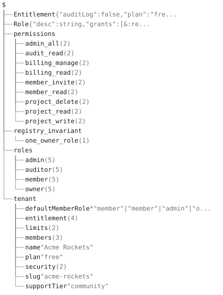

# 05. RBAC / authorization policy as ground truth



## Scenario

An RBAC model for a multi-tenant SaaS platform, written as data the
engine checks rather than as logic: a permission catalog, an
exhaustive role registry with role→permission grants, tenant plans
gating features, and agent-emitted candidate documents (tenants, role
patches) vetted against all of it.

In an agentic platform the authorization model is the document that
most needs a ground truth. An agent that hallucinates a permission
string, invents a role, or grants the wildcard to a collaborator role
has to be stopped by a machine-checkable artifact before a human reads
the diff. The model here is the registry a policy decision point (OPA,
Cedar) is compiled from: the catalog, roles, plans, and tenants come out
of `aontu example.aon` as validated, referentially sound JSON, and
`hash`, `subsume` and `breaking` give the registry the change control
a PDP does not carry. Authorization decisions
(`allow(principal, action, resource)`) and rule precedence stay with
the PDP: unification is commutative, so the model has no "later rule
wins". Ranked defaults (a `**` org baseline under a `*` team override)
decide values, and first-match `match()` decides derivations.

## The model tree

`example.aon` joins the four documents the policy is made of.
`permissions` is the catalog, `roles` the registry that grants from it,
`tenant` the candidate being vetted against both, and
`registry_invariant` the audit that runs over the registry. `Role` and
`Entitlement` are the vocabulary the entries are written in, and they
carry their canon here rather than a subtree because a type is a value,
not a container.

```
$
├── Entitlement {"auditLog":false,"plan":"fre...
├── Role {"desc":string,"grants":[&:re...
├── permissions
│   ├── admin_all (2)
│   ├── audit_read (2)
│   ├── billing_manage (2)
│   ├── billing_read (2)
│   ├── member_invite (2)
│   ├── member_read (2)
│   ├── project_delete (2)
│   ├── project_read (2)
│   └── project_write (2)
├── registry_invariant
│   └── one_owner_role (1)
├── roles
│   ├── admin (5)
│   ├── auditor (5)
│   ├── member (5)
│   └── owner (5)
└── tenant
    ├── defaultMemberRole *"member"|"member"|"admin"|"o...
    ├── entitlement (4)
    ├── limits (2)
    ├── members (3)
    ├── name "Acme Rockets"
    ├── plan "free"
    ├── security (2)
    ├── slug "acme-rockets"
    └── supportTier "community"
```

`aontu view doc --depth 2 example.aon` draws it, and `check.sh` pins it
with `--out --check`. A key with `(n)` after it is a container the
depth bound stopped at, and `n` is how many keys are not drawn; a
leaf carries its canon, which is the kind of thing it is rather
than its value.

## Layout

| file | carries |
|---|---|
| `permissions.aon` | the catalog: a `close()`d record shape per permission with a `risk` enum. Each key is the last segment of the permission's address |
| `roles.aon` | `Role`, a disjunction of two `close()`d shapes keyed by `privileged`; the `close()`d exhaustive registry; `unique()` + `refer()` grants; the same-layer `filter()`+`length()` registry invariant |
| `plans.aon` | `Entitlement`, a disjunction of closed maps, one per plan |
| `tenant.aon` | the vet schema: `re()`/`neq()` slug, plain `plan` enum, `match()`-derived limits and tier, member records with a `refer()` role foreign key, the MFA implication as a disjunction of closed maps |
| `example.aon` | a concrete tenant composed with the schema; evaluates to `expected/example.json` |
| `audits/` | the tenant and its counting and domain invariants (`filter()`+`length()`, `length(max($.ref))`, `must()`) in one document |
| `exhibits/` | the enum-with-default idiom in four spellings; ranked defaults; the registry invariant firing |
| `proposals/` | agent-emitted registry patches: a new role, a hallucinated permission, a wildcard grant |
| `queries/` | grant sets as set-as-map projections, for `subsume` |
| `data/` | tenant candidates, good and bad |

## How the model is designed

Quoted output below is trimmed of ANSI codes and machine-absolute path
prefixes.

- **Every grant is a checked address.** `refer()` on the grants list
  spread and on a member's `role` makes each one a foreign key: a tree
  path such as `$.permissions.audit_read`, resolved against the
  catalog that declares it. An unknown role in a tenant candidate vets
  `invalid` with a located `[aontu/refer_unresolved]`, and
  `proposals/extend-member-grants.aon`, which adds a permission the
  catalog does not declare, is refused with exit 1 at the element the
  agent invented, `$.roles.member.grants.3`.
- **The role set is exhaustive.** `roles` is `close()`d, so no layer
  can add a role by accident: `proposals/add-superuser-role.aon` dies
  with `[aontu/closed]: Cannot resolve value at path $.roles.superuser`.
- **Conditional shapes carry the rules.** `Entitlement` is a
  disjunction of closed maps, one per plan, so "if plan is free then
  sso is false" is a shape rather than a rule. `Role` is a disjunction
  of two closed shapes keyed by `privileged`, and the unprivileged
  branch puts `neq(path($.permissions.admin_all))` on the grants
  **list spread**, which applies it to every element.
- **`match()` derives the plan's facts.** `limits` and `supportTier`
  are computed from the candidate's `plan` during vet, so a candidate
  cannot contradict them, and `why` explains the derivation with
  provenance.
- **The tenant schema's field contracts.** `slug` is
  `string & re("^[a-z][a-z0-9-]{1,30}$") & neq(admin, root, system, api)`:
  the format by pattern, the reserved names by exclusion. `plan` is a
  plain enum, `free | pro | enterprise`, with no default.
  `defaultMemberRole` is an enum with a default, in the repeated-branch
  spelling `*member | member | admin | owner`. The member record is
  written as two spreads: `close({role: string, invitedBy?: string})`
  seals the record's keys, and a second spread puts `refer()` on
  `role`. "No MFA implies short sessions" is a disjunction of closed
  maps, `close({mfaRequired: true, …}) | close({mfaRequired: false,
  sessionTimeoutMinutes: … max(60)})`. A bare string stops at a hyphen
  (`[aontu/unexpected]`), so hyphenated values such as `"acme-rockets"`
  are quoted.
- **The enum-with-default idiom.** `exhibits/` writes it in four
  spellings, each vetted against an invite whose role is `superadmin`
  and evaluated on its own:
  - `*member | admin | owner` (`enum-default-naive.aon`) refuses
    `superadmin` with `[aontu/empty]` and generates `member` when the
    field is unset. Vet adds a `pref_not_instance` advisory: the
    default is a member of the admitted set only by being the default.
  - `*member | member | admin | owner` (`enum-default-repeated.aon`)
    admits the same set, generates the same default, and carries no
    advisory. This is the form `tenant.aon` uses.
  - `path($.roles.member) | admin | owner` (`enum-default-plain.aon`)
    enforces the set with no default, so the file does not generate on
    its own: `[aontu/disjunct_no_gen]`.
  - `(*member | member | admin | owner) & must(member | admin | owner, "…")`
    (`enum-default-guarded.aon`) enforces under vet and generates
    `member`.

  `exhibits/rank-default.aon` layers a `**viewer` org baseline under a
  `*member` team override and generates `member`.
- **Audits are a stricter layer over the schema.** `audits/*.aon`
  compose the tenant with its invariants in one document, under
  `hide()` so they stay out of the output without being suppressed:
  `exactly_one_owner` is
  `length(1) & filter($.tenant.members, {role: path($.roles.owner)})`,
  "for all" written as a counted witness set; `seats_within_plan`
  bounds the member count by the plan-derived `maxSeats`;
  `mfa_mandatory` is a `must()` carrying the policy's own words. The
  tenant schema allows `mfaRequired: false` with a short session;
  corporate policy in the audit layer does not, and `audits/no-mfa.aon`
  reports the rule as its author wrote it:
  `The author's message is: corporate policy CP-114: MFA is mandatory for every tenant`.
  `audits/two-owners.aon` fails with the two-owner witness map in the
  message. `roles.aon` carries the same pattern as a registry
  invariant, `one_owner_role: length(1) & filter($.roles, {tenantOwner: true})`,
  and `exhibits/registry-two-owners.aon` shows it firing.
- **Set questions run over set-as-map projections.** `subsume`
  compares lists positionally, so `queries/*.aon` state grant sets as
  maps (`grants: {project_read: true, member_read: true}`), kept in
  step with `roles.aon`. `subsume queries/core-read.aon queries/auditor-grants.aon`
  answers `subsumes`; the reverse is refused with a witness naming each
  missing grant (`compat_required_added` at `$.grants.billing_read` and
  `$.grants.audit_read`). Lists also unify positionally, which is why
  `proposals/extend-member-grants.aon` restates the three existing
  grants before adding one.
- **Canon keeps the policy's meaning.** The grant addresses
  (`path($.permissions.admin_all)`), `refer()`, and the
  `*"member"|"member"|"admin"|"owner"` default all survive `--canon`,
  so the canon hash covers the policy itself, grants and defaults
  included.
- **Vet and evaluation agree.** Vetting a schema against a candidate
  answers the same question as evaluating the two as one document: a
  sizing atom or a `must()` written next to a spread counts the data
  that arrives, and a closed-map branch keyed on a reference to a
  data-supplied field is selected by that data. Checks 28–31 pin this
  on small paired documents.

A patch that grants the wildcard to the unprivileged `member` role
fails at the exact element, against the `neq()` the list spread
carries:

```
$ aontu --include-root . proposals/member-wildcard.aon
[aontu/constraint]: Cannot unify values at path $.roles.member.grants.3
...
 Cannot unify value: path($.permissions.admin_all) with value: neq(path($.permissions.admin_all))
```

`why` explains the derived support tier, naming the `match()` that
produced it and the position it was written at:

```
$ aontu why '$.tenant.supportTier' example.aon
$.tenant.supportTier = "community"
  1. ("free"|"pro")|"enterprise"  tenant.aon:15:9
  2. match(.plan,"free","community","pro","standard","enterprise","dedicated")  tenant.aon:35:16
```

## What check.sh proves

`check.sh` drives the CLI end to end and asserts every outcome: exit
codes, error and reason codes grepped from the reports, and generated
documents diffed against the `expected/` goldens.

1. `example.aon` evaluates, exit 0, to `expected/example.json`: the
   catalog, the closed role registry and the concrete tenant, with
   `limits` and `supportTier` derived by `match()`.
2. `--canon example.aon` keeps `path($.permissions.admin_all)`, the
   `*"member"|"member"|"admin"|"owner"` default, and `refer()`.
3. `vet tenant.aon data/tenant-good.aon` is `verdict: valid`, exit 0,
   with no `pref_not_instance` warning.
4. A free-plan tenant enabling SSO (`data/tenant-free-sso.aon`) is
   `verdict: invalid`, exit 1, `[aontu/empty]` at `$.tenant.entitlement`.
5. A member holding an undeclared role (`data/tenant-unknown-role.aon`)
   is refused with `[aontu/refer_unresolved]`, exit 1.
6. A reserved slug (`data/tenant-bad-slug.aon`) is refused with
   `[aontu/constraint]` and the `neq("admin", …)` exclusion in the
   expected form, exit 1.
7. No MFA with a 480-minute session (`data/tenant-no-mfa.aon`) is
   `verdict: invalid` at `$.tenant.security`, exit 1.
8. A candidate without a `name` (`data/tenant-no-name.aon`) is
   `verdict: incomplete`, exit 3, `[aontu/mapval_no_gen]`.
9. A candidate without a `plan` (`data/tenant-no-plan.aon`) is
   refused, exit 1, with `disjunct_no_gen [incomplete]` reported at
   `$.tenant.plan`.
10. `vet --format json` on the unknown-role candidate carries
    `"code": "refer_unresolved"` and `"verdict": "invalid"`, exit 1.
11. `proposals/add-superuser-role.aon` is refused by the closed
    registry: `[aontu/closed]` at `$.roles.superuser`, exit 1.
12. `proposals/extend-member-grants.aon` (a permission the catalog
    does not declare) is refused with `[aontu/refer_unresolved]` at
    `$.roles.member.grants.3`, exit 1.
13. `proposals/member-wildcard.aon` (the wildcard granted to an
    unprivileged role) is refused with `[aontu/constraint]` at
    `$.roles.member.grants.3`, exit 1.
14. `audits/good.aon` evaluates, exit 0: the `filter()`+`length()` and
    `must()` invariants pass on clean data.
15. `audits/two-owners.aon` is refused with `[aontu/constraint]` at
    `$.audit.exactly_one_owner`, exit 1.
16. `audits/no-mfa.aon` is refused with `[aontu/must]` and the
    author's message, `corporate policy CP-114: MFA is mandatory for
    every tenant`, exit 1.
17. `exhibits/registry-two-owners.aon` is refused with
    `[aontu/constraint]` at `$.registry_invariant.one_owner_role`,
    exit 1: `hide()` does not suppress the check.
18. `*member | admin | owner` (`exhibits/enum-default-naive.aon`)
    vetted against `data/invite-superadmin.json` is `verdict: invalid`,
    `[aontu/empty]`, exit 1, with the `pref_not_instance` advisory.
19. The repeated branch (`exhibits/enum-default-repeated.aon`) is
    `verdict: invalid`, `[aontu/empty]`, exit 1, with no
    `pref_not_instance` advisory.
20. The repeated form evaluated alone generates `"role": "member"`,
    exit 0.
21. The plain enum (`exhibits/enum-default-plain.aon`) refuses
    `superadmin` with `[aontu/empty]`, exit 1, admits
    `data/invite-member.aon`, exit 0, and evaluated alone is
    `[aontu/disjunct_no_gen]`, exit 1: there is no default to generate.
22. The `must()`-guarded form (`exhibits/enum-default-guarded.aon`) is
    `verdict: invalid` for `superadmin`, exit 1, and evaluated alone
    generates `"role": "member"`, exit 0.
23. Ranked preferences (`exhibits/rank-default.aon`): `*member`
    outweighs `**viewer`, and `"defaultRole": "member"` is generated.
24. `get '$.tenant.limits' example.aon` matches `expected/limits.json`.
25. `why '$.tenant.supportTier' example.aon` prints
    `$.tenant.supportTier = "community"` and names the `match(.plan, …)`
    in `tenant.aon`.
26. `subsume queries/core-read.aon queries/auditor-grants.aon` is
    `verdict: subsumes`, exit 0; the reverse is exit 1 with
    `compat_required_added`.
27. The same two grants as lists in different orders
    (`["project_read", "member_read"]` against the reverse) are
    `does_not_subsume`, exit 1: lists compare positionally.
28. A vet schema `x: length(min(1)) & { &: {r: integer} }` against
    data with one entry is `verdict: valid`, exit 0.
29. `x: length(max(2)) & { &: {r: integer} }` against three entries is
    `verdict: invalid` at `$.x`, exit 1.
30. A closed-map branch keyed on a reference to a data-supplied field
    (`e: $.Ent & { plan: $.t.p }`, with data `p: "free"` and
    `e.sso: true`) is `verdict: invalid`, `[aontu/empty]`, exit 1 under
    vet, and the same composition evaluated as one document reports
    `[aontu/empty]` too.
31. `s: {t: integer} & must({t: max(60)}, "session too long")` against
    `t: 120` is `verdict: invalid` with `session too long` under vet,
    exit 1, and the same rule and data in one file is `[aontu/must]`,
    exit 1.

## Running it

`./check.sh`, from anywhere; set `AONTU=` to point at another build.
Every step prints a numbered line, and the script stops at the first
failure. The proposals and audits include their parents from one
directory up, so run them from the case directory with
`--include-root .`, as `check.sh` does:

```sh
aontu --include-root . proposals/member-wildcard.aon
aontu vet tenant.aon data/tenant-unknown-role.aon
```

The how-to guides [Forbid unexpected keys](../../docs/how-to/forbid-unexpected-keys.md),
[Constrain every element of a list](../../docs/how-to/constrain-list-elements.md),
[Provide defaults that callers can override](../../docs/how-to/provide-defaults.md)
and [Keep schema and helper fields out of the output](../../docs/how-to/keep-schema-out-of-output.md)
walk the `close()`, list-spread, default and `hide()` recipes this case
runs together.
