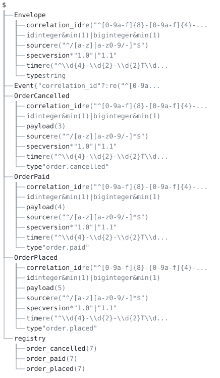

# 07 — event/message contracts (the schema-registry case)



## Scenario

An order service publishes `order.placed`, `order.paid` and
`order.cancelled` events to a stream. The contract is what a Kafka
schema registry holds: a shared envelope (id/type/time/source), one
payload schema per event type, a discriminated union over all of
them, and a compatibility gate between contract versions. Producers
vet before publishing; consumers vet what they receive; CI refuses a
contract revision that breaks subscribers. This is the bread and
butter of event-driven enterprise systems.

## The model tree

`orders-v1.aon` is one revision of the contract. `Envelope` is the
shared head every event carries; `OrderPlaced`, `OrderPaid` and
`OrderCancelled` are the payload schemas; `Event` is the union a
consumer vets against, and `registry` the instances the checks drive.

```
$
├── Envelope
│   ├── correlation_id re("^[0-9a-f]{8}-[0-9a-f]{4}-...
│   ├── id integer&min(1)|biginteger&min(1)
│   ├── source re("^/[a-z][a-z0-9/-]*$")
│   ├── specversion *"1.0"|"1.1"
│   ├── time re("^\\d{4}-\\d{2}-\\d{2}T\\d...
│   └── type string
├── Event {"correlation_id"?:re("^[0-9a...
├── OrderCancelled
│   ├── correlation_id re("^[0-9a-f]{8}-[0-9a-f]{4}-...
│   ├── id integer&min(1)|biginteger&min(1)
│   ├── payload (3)
│   ├── source re("^/[a-z][a-z0-9/-]*$")
│   ├── specversion *"1.0"|"1.1"
│   ├── time re("^\\d{4}-\\d{2}-\\d{2}T\\d...
│   └── type "order.cancelled"
├── OrderPaid
│   ├── correlation_id re("^[0-9a-f]{8}-[0-9a-f]{4}-...
│   ├── id integer&min(1)|biginteger&min(1)
│   ├── payload (4)
│   ├── source re("^/[a-z][a-z0-9/-]*$")
│   ├── specversion *"1.0"|"1.1"
│   ├── time re("^\\d{4}-\\d{2}-\\d{2}T\\d...
│   └── type "order.paid"
├── OrderPlaced
│   ├── correlation_id re("^[0-9a-f]{8}-[0-9a-f]{4}-...
│   ├── id integer&min(1)|biginteger&min(1)
│   ├── payload (5)
│   ├── source re("^/[a-z][a-z0-9/-]*$")
│   ├── specversion *"1.0"|"1.1"
│   ├── time re("^\\d{4}-\\d{2}-\\d{2}T\\d...
│   └── type "order.placed"
└── registry
    ├── order_cancelled (7)
    ├── order_paid (7)
    └── order_placed (7)
```

`aontu view doc --depth 2 orders-v1.aon` draws it, and `check.sh` pins it
with `--out --check`. A key with `(n)` after it is a container the
depth bound stopped at, and `n` is how many keys are not drawn; a
leaf carries its canon, which is the kind of thing it is rather
than its value.

## Files

| File | Role |
|---|---|
| `envelope.aon` | shared envelope: id, type, time, source, specversion, correlation_id |
| `orders-v1.aon` | the v1 contract: three closed event shapes, the `Event` union, the dispatch `registry` |
| `orders-v1-1.aon` | additive minor revision (optional field + new event type) |
| `orders-v2.aon` | deliberately breaking revision (required field added, enum narrowed) |
| `probes/*.aon` | small documents, one question each: the two spellings of an enum with a default, a regex outside the portable subset, a `match()` dispatcher; `data/probe-*.json` are their instances |
| `data/stream/` | a valid three-event stream sample |
| `data/bad/`, `data/ids/` | invalid events and id edge cases |
| `expected/` | canon and inventory goldens |

## How the model is designed

- **Shared envelope by conjunction.** Each event shape is
  `close($.Envelope & { type: "order.paid", payload: close({...}) })`.
  The envelope include (`@"envelope.aon"`) plus a reference
  conjunction gives real reuse; `close()` seals each shape so surplus
  keys are refused, and the envelope's optional `correlation_id?`
  stays optional through the conjunction.
- **Discriminated union.** `Event: $.OrderPlaced | $.OrderPaid |
  $.OrderCancelled`, discriminated by the pinned `type` string in
  each branch.
- **Dispatch registry.** `registry: {order_placed: $.OrderPlaced, ...}`
  so consumers can vet one branch: `vet --at '$.registry.order_paid'`.
  Keys are underscored because a dot in a path is always a
  separator, with no quoting or escaping form, so a key spelled
  `order.placed` cannot be addressed; the consumer maps the wire type
  with `${type//./_}`.
- **Formats by regex.** RFC 3339 timestamps, UUID v4 correlation ids
  and the `ord-`/`psp-` id shapes are all `re()` patterns.
- **Ids across the number tower.** `id: (integer | biginteger) &
  min(1)` admits both a plain JSON id and a `0d`-spelled 19-digit
  id: `integer` alone would refuse every `0d` id, and `number` alone
  would admit floats.
- **Enum with a default.** `specversion: ("1.0" | "1.1") & *"1.0"`
  conjoins the allowed set with a preference for one member. An
  event that omits the field is filled with `"1.0"` under vet, and
  plain evaluation generates the same value.
- **Versions as whole documents.** Including v1 and restating
  `Event:` would unify (intersect) the two unions rather than extend
  one, so each revision is a full copy of its predecessor plus the
  delta, and `breaking --against`, anchored at the union with
  `--at '$.Event'`, is what keeps the copies honest.

Vetting is anchored. One command vets a whole stream sample at the
union, `vet --at '$.Event' orders-v1.aon data/stream/*.json`, with
one worst-verdict exit code, and the 0/1/3 distinction (valid,
invalid, incomplete) maps onto "accept", "drop the message" and "the
producer sent a partial event". At the union anchor a conflict inside
the selected branch is reported as one `empty` finding at `$.Event`,
with the whole disjunction as the schema site and no field path; an
event whose `type` matches no branch is reported with the same
header. The registry is what gives a consumer the field-level
finding. The same event (`"type": "order.paid"`, `amount_cents: 0`)
at the branch anchor names the path, the expected residual, the
actual value, and row/col in both files:

```
$.registry.order_paid.payload.amount_cents: constraint [conflict]
  [aontu/constraint]: Cannot unify values at path $.registry.order_paid.payload.amount_cents
  expected: integer&min(1)
  actual:   0
  data: data/bad/paid-zero-amount.json:9:21 (0)
  schema: orders-v1.aon:33:29 (integer&min(1))
```

Incomplete data does localise at the union. A paid event that omits
`source` is reported at the field, because the other branches fall
away on `type` and the residue is named:

```
$.Event.source: mapval_required [incomplete]
  [aontu/mapval_required]: Cannot resolve value at path $.Event.source
  schema: envelope.aon:30:11 (re("^/[a-z][a-z0-9/-]*$"))
```

A dotted key is out of reach of every path spelling:

```
$ aontu get '$.registry."order.placed"' orders-v1.aon
$.registry."order.placed": no_path [reference]
  The path $.registry."order.placed" names nothing in this document.
```

`re()` takes a portable pattern subset, and a quantifier applied to
a group containing another quantifier is outside it, so the natural
optional-fraction spelling `(\.\d+)?(Z|[+-]\d{2}:\d{2})`
(`probes/frac-group.aon`) is refused:

```
[aontu/constraint_pattern]: Cannot constrain value at path $.BadTime.time

This re() pattern is outside the supported subset. It uses
a quantifier applied to a group containing another quantifier, which backtracks exponentially in JavaScript.
```

The refusal goes on to print the accepted subset in full. The
envelope writes the optionality as one unquantified alternation
group, `(Z|\.\d+Z|[+-]\d{2}:\d{2}|\.\d+[+-]\d{2}:\d{2})`. A pattern
checks shape, not the calendar: `2026-13-41T25:61:61Z` matches it and
vets valid.

A 19-digit id written as a plain JSON literal is refused rather than
rounded, because binary64 cannot hold it exactly:

```
$.id: lossy_integer_literal [conflict]
  [aontu/lossy_integer_literal]: Cannot resolve value at path $.id
  data: data/ids/paid-id-19digit-plain.json:2:9 (nil)
```

Plain evaluation of the same file prints the full explanation
("Aontu refuses rather than corrupts: write it as a `0d` literal").
The exact spelling, `0d9223372036854775807`, vets valid against
`(integer | biginteger) & min(1)`. It is Aontu syntax rather than
JSON, and a strict JSON parser refuses the file that carries it.

Contract versions are gated by `breaking --against`. A revision that
narrows an enum and adds a required payload key is refused with both
witnesses:

```
$.OrderPlaced.payload.currency: compat_narrowed [compat]
  a specific alternative is not admitted by the general value
  expected: "EUR"|"USD"
  actual:   "GBP"
  general: orders-v2.aon:17:15 ("EUR"|"USD")
  specific: orders-v1.aon:16:31 ("GBP")
$.OrderCancelled.payload.reason: compat_required_added [compat]
  the general value requires this key; the specific value admits instances without it
  expected: re("^[a-z_]{3,40}$")
  actual:   {"cancelled_by":"customer"|"merchant"|"system","note"?:string,"order_id":re("^ord-[0-9a-f]{8}$")}
  general: orders-v2.aon:41:13 (re("^[a-z_]{3,40}$"))
  specific: orders-v1.aon:40:12 ({"cancelled_by":"customer"|"merchant"|"system","note"?:string,"order_id":re("^ord-[0-9a-f]{8}$")})
```

The report continues under `$.Event` and `$.registry`, which
reference the changed shapes. `compat_required_added` on a payload
field is the finding a registry wants for the most common break.
`breaking` compares whole documents by default, so a new top-level
definition reads as a required key: the additive v1.1 revision (an
optional `settled_at`, a new `OrderRefunded` type) is `breaking` at
`$.OrderRefunded` as a whole document and `compatible` anchored at
the union with `--at '$.Event'`, which keeps `--mode`, the policy
declaration and the `--allow-*` flags. `subsume --at '$.<Type>'
<new> <old>` gives the same answer one event type at a time, for the
types both versions declare.

`why` traces a shared field back through the reference conjunction
to the file that wrote it:

```
$.OrderPaid.time = re("^\\d{4}-\\d{2}-\\d{2}T...")
  1. re("^\\d{4}-\\d{2}-\\d{2}T...")  .../envelope.aon:27:9
```

`--canon` renders the value without its marks, so the canonical text
of the contract is an open map: re-parsed as a schema it admits the
surplus `topic` key that the contract refuses, and it hashes
differently from the contract, because `hash` is taken over the
marked form (`hash --form` prints it, `close()` and all). A registry
stores and serves the source file and pins it with `aontu hash`. Two
envelopes that differ only in which `specversion` is preferred
(`probes/default-a.aon`, `probes/default-b.aon`) hash differently,
as two contracts that generate different values should.

## What check.sh proves

`check.sh` drives the CLI end to end and asserts every outcome: exit
codes, codes grepped from the reports, goldens diffed under
`expected/`, and one `--format json` report checked field by field.

1. `--canon orders-v1.aon` matches `expected/orders-v1.canon`;
   `get '$.OrderPaid' --canon` matches `expected/order-paid.canon`;
   `get '$.registry' --keys` matches `expected/registry-keys.txt`;
   `hash orders-v1.aon` prints an `aon1-` pin.
2. `vet --at '$.registry.order_paid'` refuses
   `data/bad/paid-surplus-topic.json` with `[aontu/closed]`, exit 1.
   The canonical text from `expected/orders-v1.canon`, re-parsed as
   the contract, admits the same event (`verdict: valid`, exit 0) and
   hashes differently from `orders-v1.aon`.
3. `probes/default-a.aon` and `probes/default-b.aon`, which differ
   only in the preferred `specversion`, print different `aon1-` pins.
4. `why '$.OrderPaid.time' orders-v1.aon` names `envelope.aon` as the
   file that wrote the pattern.
5. Plain evaluation of `orders-v1.aon` exits 1 with
   `[aontu/disjunct_no_gen]` at `envelope.aon:14:7`: the envelope's
   `id` is a disjunction with no preferred alternative, so the
   contract is a schema to vet against rather than a document to
   generate.
6. `vet --at '$.Event'` over the three-event stream sample is
   `verdict: valid`, exit 0, in one command.
7. `data/stream/cancelled-1003.json`, which omits `specversion`,
   vets valid at `$.Event`, and `get '$.Envelope.specversion'
   envelope.aon` reads the filled default, `"1.0"`.
8. A stream with one bad event (`placed-1001.json` plus
   `data/bad/paid-zero-amount.json`) is `verdict: invalid`, exit 1:
   the worst verdict wins.
9. `data/bad/paid-zero-amount.json` (valid discriminator,
   `amount_cents: 0`) at `$.Event` is `verdict: invalid` with a single
   finding, `$.Event: empty [conflict]`, whose schema site is the
   whole disjunction: all three `type` strings in one value of more
   than 1,500 characters, at a real row and column. The report names
   no `payload.amount_cents` path and no `expected:` line;
   `--format json` carries the same one finding, code `empty`, path
   `$.Event`.
10. The same event at `$.registry.order_paid`: `constraint [conflict]`
    at `.payload.amount_cents`, `expected: integer&min(1)`,
    `[aontu/constraint]`.
11. The consumer dispatch loop: for each stream event, read `type`,
    replace its dots with underscores, and
    `vet --at "$.registry.<key>"`; all three events are valid.
12. `data/bad/refunded-unknown-type.json`, whose `type` no branch
    declares, at `$.Event`: `$.Event: empty [conflict]`, with the same
    finding header as the bad-payload event.
13. `data/bad/paid-missing-source.json` at `$.Event`:
    `verdict: incomplete`, exit 3, `$.Event.source: mapval_required`.
14. `get '$.registry."order.placed"' orders-v1.aon` exits 1 with
    `no_path`.
15. `data/bad/placed-bad-time.json` (`26/08/2026 10:07`) at
    `$.registry.order_placed`: `.time: constraint [conflict]`,
    `[aontu/constraint]`; the schema site names `envelope.aon`, and
    the row it cites holds the `time:` pattern in that file and not in
    `orders-v1.aon`.
16. `data/bad/placed-month-13.json` (`2026-13-41T25:61:61Z`) at
    `$.Event` is `verdict: valid`, exit 0: the pattern checks shape,
    not the calendar.
17. `probes/frac-group.aon` is refused with
    `[aontu/constraint_pattern]`, naming the quantifier applied to a
    group containing another quantifier.
18. `data/ids/paid-id-19digit-plain.json` at `$.registry.order_paid`:
    exit 1, `[aontu/lossy_integer_literal]`; the vet finding carries
    the code and the data site only.
19. Plain evaluation of the same file exits 1 and prints the
    explanation, including "write it as a `0d` literal".
20. `data/ids/paid-id-19digit-0d.json` (`0d9223372036854775807`) at
    `$.registry.order_paid` is `verdict: valid`, exit 0.
21. `data/ids/paid-id-19digit-0d.json` is refused by Python's strict
    `json.load`: the `0d` spelling is Aontu syntax, not JSON.
22. `probes/pref-enum.aon` (`v: *"1.0" | "1.1"`) against
    `data/probe-v99.json` (`"9.9"`): `verdict: invalid`, exit 1,
    `[aontu/empty]`, plus a `pref_not_instance` advisory that the
    default `"1.0"` is not an instance of any remaining alternative.
23. `probes/default-a.aon` (`("1.0" | "1.1") & *"1.0"`) evaluates to
    `"v": "1.0"`, exit 0.
24. `probes/match-dispatch.aon`, a `match()` over the instance's own
    `type`, at `$.Event` with valid data (`data/probe-placed-ok.json`):
    `verdict: incomplete`, exit 3, `[aontu/conjunct]`. The union is
    the spelling for a discriminated set of shapes; branch selection
    is the consumer's dispatch step.
25. `breaking --against orders-v1.aon orders-v1.aon` is
    `verdict: compatible`, exit 0, with no `sub_unresolved`: a
    contract admits itself, the order-lines list template included.
26. `breaking --against orders-v1.aon orders-v1-1.aon`, whole
    document, is `verdict: breaking`, exit 1,
    `$.OrderRefunded: compat_required_added`.
27. The same pair with `--at '$.Event'` is `verdict: compatible`,
    exit 0.
28. `breaking --against orders-v1.aon orders-v2.aon` is
    `verdict: breaking`, exit 1, with
    `$.OrderCancelled.payload.reason: compat_required_added` and a
    `compat_narrowed` naming `"GBP"`.
29. Per-branch `subsume --at '$.<Type>' <new> <old>`: `OrderPaid`,
    `OrderCancelled` and `OrderPlaced` of v1.1 each subsume their v1
    counterpart (`verdict: subsumes`, exit 0); `OrderCancelled` of v2
    is refused, exit 1, `compat_required_added` on `reason`.

## Running it

`./check.sh`, from anywhere; set `AONTU=` to point at another CLI
build. `python3` must be on the path: the dispatch loop and the JSON
report check use it. Every check prints an `ok` line, and the script
stops at the first failure.

The two commands the case is built around, by hand:

```sh
aontu vet --at '$.Event' orders-v1.aon data/stream/*.json              # the consumer's stream check
aontu breaking --against orders-v1.aon --at '$.Event' orders-v1-1.aon  # the registry's gate
```

[Validate data in CI](../../docs/how-to/validate-in-ci.md) and
[Gate schema changes](../../docs/how-to/gate-schema-changes.md) walk
the same two commands in a smaller setting; the flags are in the
reference under
[`aontu breaking`](../../docs/reference-api.md#aontu-breaking).
