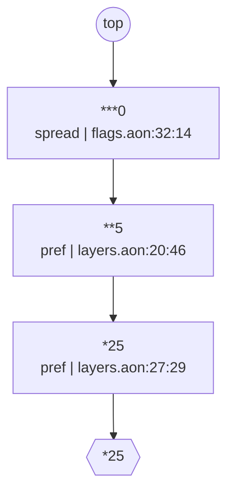

# 08 — feature flags / runtime config (the write-path case)

## The arbitration, drawn



The meet ladder for one path, generated by
[`../tools/diagram.js`](../tools/diagram.js) from `why` alone and pinned
as a golden by `check.sh`. Each rung is one contribution, carrying its
canon, its role and its source position; the descent runs from `top` to
the resolved value.

**Fewer stars win**, so the rungs read weakest-first and the winner is
the last rung before the value: the org catalog's `***0`, then the prod
environment's `**5`, then the megacorp tenant's `*25`, which is the
answer. `aontu why` prints the same three facts as three lines; what
the ladder adds is that the arbitration is a shape.

The rungs had to be **sorted** to draw this. `why` returns its
conjuncts in the order the recorder saw the meets, which is not rank
order — an emitter that trusted the record's order would draw an
arbitration that did not happen. The rank itself is recovered by
counting the canon's leading stars, because `WhyConjunct` carries no
rank field; the view design names adding one as a required change,
since re-deriving a value the engine already has is exactly what this
repository refuses elsewhere.


A feature-flag service is the config system that gets WRITTEN the
most: a catalog of flag definitions (type, default, owner, expiry),
per-environment and per-tenant overrides, and an operational loop in
which an agent or on-call operator changes a flag NOW — without
editing the reviewed base files. LaunchDarkly/Unleash/ConfigCat is
the incumbent; the aontu pitch is that the same document that serves
the config is the ground truth that constrains the change. So this
case leans on the write path: `aontu set <path>=<value> --entry
base.aon --overlay overlay.aon`, run repeatedly, plus `why` for
provenance and `--trust` for hostile-overlay containment. The
question is not "can it model flags" (it can) but "is
overlay-append viable for fleet automation".

Run `./check.sh` — 43 assertions drive every claim below against the
real CLI. All mutation happens in a temp copy; the committed
`overlay.aon` is never touched.

## Files

| File | Role |
|---|---|
| `flags.aon` | org-wide catalog: 6 flags, owner/expiry regexes, ranked `***` lifecycle defaults, one kill-switch pin, one narrow-only `message?` field |
| `layers.aon` | `**` environment and `*` tenant layers (hidden), plus the `effective.<env>.<tenant>` views a flag SDK would read |
| `policy.aon` | `clock.today` (stamped data — the language has no clock), the expired-flag lifecycle audit, the 0..100 rollout audit, both as `filter()` + `must(close({}))` |
| `base.aon` | flags + layers + policy: the `--entry` for `set` (must NOT include the overlay) |
| `overlay.aon` | the ops overlay, written only by `aontu set` |
| `system.aon` | base + overlay: the runtime view served to SDKs; `get`/`why`/eval run here |
| `flag-schema.aon` | the strict `Flag` definition, a *vet-only* document (the split is forced — gap 2) |
| `data/` | agent-proposed flag candidates: one clean, one five-way-bad, one incomplete |
| `attack/` | a hostile overlay pulling `@"/etc/hostname"` into a flag value |
| `expected/` | JSON goldens for the build and all four effective views, plus the catalog canon |

## How the model is designed

- **Rank ladder for defaults.** Org catalog defaults are `***` (the
  weakest), environments `**`, tenants `*`; a concrete pin beats any
  rank. FEWER stars win when preferences meet, so
  `***0 & **5 & *25 = 25` with no priority table anywhere — the
  check walks all six rungs (org value, env-beats-org, tenant-beats-
  env, tenant opt-out to 0, env enabling an org-dark flag, variant
  strings through all three ranks).
- **Effective views by reference conjunction.**
  `effective.prod.megacorp: $.flags & $.envs.prod.flags &
  $.tenants.megacorp.flags`. A reference unifies a copy in place, so
  every overlay write flows into the served views automatically.
- **Kill switch = concrete pin.** `payments_legacy_gateway.enabled:
  false` is a plain literal, so no overlay (rank or concrete) can
  flip it — `set` refuses with the pinning site (see "worked").
- **Narrow-only field.** `ops_incident_banner.message?: string &
  length(max(80))` carries a constraint but no value; the first
  concrete value arrives via `set`, which may narrow but never
  contradict.
- **Expiry as data + audit.** Dates are `re()`-checked strings;
  `clock.today` is stamped by CI. The cross-field rule "expired
  flags must be disabled" is `filter($.flags, { expiry:
  below($.clock.today), enabled: true })` feeding
  `must(close({}), ...)` — the violation set must be empty. It lives
  in policy.aon, NOT in a shared Flag def, because a relative
  reference inside a referenced def does not rebind to the instance.
- **The strict schema is a separate vet-only document** — not by
  choice; three interacting limits force the split (gap 2).

## What worked

- **Rank arbitration is the right primitive for org→env→tenant.**
  All six ladder assertions pass with bare `***`/`**`/`*` literals
  and zero merge machinery. The tenant opt-out (`*0` beating `**5`)
  and the env enabling an org-dark flag both come out right, and the
  four effective views match their JSON goldens byte for byte.
- **The contradiction refusal is exactly what a flag service wants.**
  Setting the kill switch on names both sides, with the pinning
  site's line, and writes nothing:

  ```
  verdict: invalid

  $.flags.payments_legacy_gateway.enabled: scalar_value [conflict]
    [aontu/scalar_value]: Cannot unify values at path $.flags.payments_legacy_gateway.enabled
    data: overlay.aon:2:48 (true)
    schema: base.aon:53:14 (false)
  ```

  (exit 1; the overlay is untouched — asserted). Narrowing is
  distinguished correctly: the first concrete `message` under the
  `length(max(80))` constraint is `verdict: valid`, the 84-char one
  is refused with `[aontu/constraint]` and the residual
  `expected: string&length(integer&min(0)&max(80))`.
- **`--in-place` is a genuinely fleet-safe write mode.** Ten
  successive sets of the same path leave ONE overlay line, each run
  reporting the edit it made:

  ```
  verdict: valid
  replaced: overlay.aon:2:59 90 -> 55
  wrote: overlay.aon
  # Ops overlay: written by `aontu set`, never by hand.
  "tenants": "megacorp": "flags": "checkout_v2": "rollout": 55
  ```

  Idempotent, convergent, and the span is verified against the
  source text before writing.
- **`why` attributes overlay writes to the overlay FILE, with rank
  annotations.** At the layer path the whole story is there:

  ```
  $.tenants.megacorp.flags.checkout_v2.rollout = 55
    1. *25  layers.aon:27:29  (pref)
    2. 55  overlay.aon:2:59
  ```

  File-level provenance for free — half of an audit trail (see
  "what a real service still needs"; and gap 5 for where this
  breaks).
- **vet's verdict classes map onto the agent workflow.** A clean
  agent-proposed flag: exit 0. A bad one: exit 1 with five findings
  (key case, foreign owner domain, short description, slashed date,
  rollout 150) plus `[aontu/closed]` on the smuggled `jira_ticket`.
  A half-written one: exit 3 `incomplete` — "not wrong yet" is a
  distinct machine-readable state, which JSON Schema does not give.
  `--format sarif` works for CI ingestion.
- **The trust profile contains a hostile overlay.** Under
  `--trust root:<model-dir>` the in-tree model evaluates normally
  and the attack overlay's absolute include is refused at parse
  time:

  ```
  include denied: /etc/hostname (capability: root:<model-dir>)
  ```

  `--trust none` is fully hermetic (even `./base.aon` is refused).
  This is the right shape for evaluating agent-written overlays.
- **The audits fire post hoc with the author's message.** With a
  zombie line in the overlay, evaluating `system.aon` fails with
  `[aontu/must]` and `expired flags must be disabled`, naming the
  offending flag's full value. Rolling the line back (or `set`-ting
  the value back `--in-place`) restores a green view — asserted both
  ways.

## What a real flag service still needs

The overlay after any number of sets is bare assignments:
`"tenants": "megacorp": "flags": "checkout_v2": "rollout": 55`. No
actor, no timestamp, no reason, and `--in-place` *destroys* history
by design (ten writes leave one line). `why` attributes values to
files, not to people — so file-per-actor or overlay-per-change plus
VCS is the only audit path, and nothing in the language links a line
to who wrote it. A production service would wrap `set` in something
that logs (actor, assignment, verdict, hash before/after) — the
`hash` verb is a good anchor for that — but none of it exists in the
box.

## Gaps and friction

### 1. KEY FINDING — `must()` audits cannot guard the write path (critical) — FIXED 2026-08-27

**Closed by [ADR-007](../../ADR.md).** The two policy rules this
scenario most needs at write time (expired flags stay off; rollout in
0..100) now fire at write time:

```
$ aontu set '$.flags.search_reranker_v3.enabled=true' --entry base.aon --overlay overlay.aon
verdict: invalid        # exit 1, nothing written

$.policy.lifecycle.catalog: must [conflict]
  note: expired flags must be disabled
```

The cause was not that `must()` is opaque to vet. It was that vet met
the SETTLED entry: the standalone pass had already discharged the
entry's audits against the entry's own values, before the overlay
existed. vet now builds its meet from a fresh parse, so the audit meets
the value being written. The write path and the read path agree, and a
refused write never reaches the overlay. The rest of this entry is the
diagnosis as it stood.

`set`'s verdict is vet's verdict of entry-vs-overlay. The rules were
silently skipped by the verb whose job is to gate writes, even though
`base.aon` *includes* `policy.aon`. Enabling the expired flag:

```
$ aontu set '$.flags.search_reranker_v3.enabled=true' --entry base.aon --overlay overlay.aon
verdict: valid
wrote: overlay.aon
$ aontu system.aon
[aontu/must]: Cannot unify values at path $.policy.lifecycle.catalog

This value fails an evaluate-only check written with must().
The author's message is: expired flags must be disabled
```

Same trap for range: `set ... rollout=200 --in-place` was
`verdict: valid` / `replaced: overlay.aon:2:59 55 -> 200`, and the
next evaluation of the runtime view failed on
`$.policy.rollout_range.megacorp_high`. The write the tool accepted
made EVERY subsequent evaluation of the served document fail — for
a fleet, that is "config service down", not "one flag wrong". The
workaround was to treat `set` + full eval of `system.aon` as one
transaction and roll the overlay back on a non-zero eval, which is the
caller reimplementing the gate the verb advertises. No longer needed:
both traps are refused at write time, and check.sh now asserts that
neither refused line reaches the overlay.

### 2. A constraint and a ranked default cannot share a field — and the workaround is silently wrong (critical)

The natural catalog spelling is `enabled: boolean & ***false`,
`rollout: integer & min(0) & max(100) & ***0`. The conjunct form
does not generate:

```
[aontu/mapval_no_gen]: Cannot resolve value at path $.x
 Cannot resolve value: boolean
```

That failure is at least loud. The disjunct form
(`***false | boolean`) is worse: it evaluates, but rank arbitration
is silently lost through the effective-view references. Minimal
repro (env `**true` should beat org `***false`):

```
flags: f: { enabled: ***false | boolean }   ->  $.eff.f.enabled = false   (WRONG, silent)
flags: f: { enabled: ***false }             ->  $.eff.f.enabled = true    (correct)
```

A wrong flag value served with zero diagnostics is the worst
possible failure mode for this domain. Forced consequences, all
load-bearing in this model: defaulted fields carry BARE preferences
(kind-safety only via the preference gate); the range rule is
demoted to the post-hoc audit of gap 1; and the strict Flag
definition must live in a separate vet-only document
(`flag-schema.aon`), because it cannot coexist with the defaults —
which in turn opens gap 3.

### 3. The write path has no closed world: a typo'd path writes straight through to the served config (major)

The catalog maps are open (the closed Flag def is vet-only, gap 2),
and `set` enforces no schema beyond unification. So the same 84-char
message that was correctly refused on `ops_incident_banner`
(which declares `message?`) is ACCEPTED on `search_reranker_v3`
(which declares no message at all) — this is the step a previous
run of this case tripped over, expecting a refusal:

```
$ aontu set '$.flags.search_reranker_v3.message="this incident message is deliberately way over the eighty character maximum length"' --entry base.aon --overlay overlay.aon
verdict: valid
wrote: overlay.aon
$ aontu get '$.effective.prod.base.search_reranker_v3.message' system.aon
"this incident message is deliberately way over the eighty character maximum length"
```

Any misspelled flag name or field lands as a new open-map entry and
is served. The read-side contract does catch it — vet of the
resolved flag against `--at '$.Flag' --closed` is exit 1 — so the
guard exists but only on the path nobody is forced to run.
Workaround: after every set, `get` each touched flag and vet it
against the strict def (per-flag loop; see gap 8 for why not the
whole view at once).

### 4. Append-mode `set` is not idempotent; the overlay self-poisons after two writes (major)

Re-setting the SAME value is `verdict: valid` and appends a
duplicate line; the next DIFFERENT value then conflicts against the
earlier pin — the overlay has made itself unwritable for that path:

```
# Ops overlay: written by `aontu set`, never by hand.
"tenants": "megacorp": "flags": "checkout_v2": "rollout": 50
"tenants": "megacorp": "flags": "checkout_v2": "rollout": 50

$ aontu set '$.tenants.megacorp.flags.checkout_v2.rollout=60' --entry base.aon --overlay overlay.aon
verdict: invalid

$.tenants.megacorp.flags.checkout_v2.rollout: scalar_value [conflict]
  data: overlay.aon:4:59 (60)
  data: overlay.aon:2:59 (50)
```

For fleet automation the default mode is therefore a trap: two
identical retries (the most common automation event) wedge the
path. Workaround: always pass `--in-place` — it is strictly better
in this scenario (10 sets, 1 line, asserted) — but a safe default
should not be opt-in, and append mode accumulates garbage even when
it works.

### 5. `why` cannot see through references: provenance is blind at exactly the paths the service serves (major)

At the layer path, `why` is excellent (see "worked"). At the
EFFECTIVE path — the one an SDK reads and the one an operator will
ask about — the reference-composed copy hides everything:

```
$ aontu why '$.effective.prod.megacorp.checkout_v2.rollout' system.aon
$.effective.prod.megacorp.checkout_v2.rollout = 55
  1. ***0  flags.aon:32:14  (spread)
```

The value 55 is correct, but the only contribution listed is the
org catalog's `***0` spread — the env `**5`, the tenant `*25` and
the overlay's winning 55 are all invisible. An operator asking "why
is megacorp at 55" at the natural path gets an answer that names
the one file that did NOT decide the value. Workaround: know the
model's internals and ask at `$.tenants...`/`$.envs...` instead —
which defeats the point of provenance for anyone but the author.

### 6. `hide()` on a vet anchor silently disables the incompleteness verdict (major)

Minimal repro — the same missing required field is `incomplete`
(exit 3) from an unhidden anchor and `valid` (exit 0) from a hidden
one:

```
Flag: hide({ a: string, b: integer })   + {"a":"x"}  ->  verdict: valid      exit 0
Flag: { a: string, b: integer }         + {"a":"x"}  ->  verdict: incomplete exit 3
```

`hide()` is the natural spelling for a defs block, and the failure
is a silent false PASS. This is the third leg forcing
`flag-schema.aon` out of the generated model (with gap 2): the defs
must stay unhidden to vet honestly, and unhidden defs would leak
into generated output.

### 7. `set` diagnostics attribute constraint sites to the entry file with the included file's line number (minor)

The over-length refusal points at `base.aon:87:24` — but base.aon
is 6 lines long; line 87, column 24 is `flags.aon`:

```
$.flags.ops_incident_banner.message: constraint [conflict]
  data: overlay.aon:3:44 ("this incident message is deliberately way over the eighty character maximum length")
  schema: base.aon:87:24 (string&length(integer&min(0)&max(80)))
```

(Same for the kill switch: `schema: base.aon:53:14 (false)` —
flags.aon:53.) A repair agent opening the named file at the named
line finds a comment in a 6-line include manifest. `why` gets
per-file attribution right, so the information exists.
Workaround: `why <path>` to locate the true site.

### 8. `vet --at` re-roots the document, so a spread template referencing a sibling def cannot validate a whole view (minor)

The obvious "validate the entire effective view" spelling —
`Catalog: { &: $.Flag }`, then `vet --at '$.Catalog'` — fails with
a schema-side reference error (misleadingly classed `invalid`, as
if the data were wrong):

```
$.Catalog.&: no_path [reference]
  [aontu/no_path]: Cannot resolve value at path $.Catalog.&
  schema: t8.aon:2:15 ($.Flag)
```

`--at` re-roots at the anchor and `$.Flag` no longer resolves.
Workaround (used by check.sh): extract each flag with `get` and vet
it against `--at '$.Flag'` one at a time.

### 9. The lifecycle audit sees only concrete enablement: a rank-default zombie evades it (minor)

`filter()` judges children before preferences resolve, so an
expired flag switched on by a hand-edited `**true` in the env layer
evaluates CLEAN (exit 0) while the served view says
`enabled: true`. Verified against this model with a scratch env
layer over base.aon. Every `aontu set` writes a concrete literal,
so the write path is fully guarded; the hole is hand edits to the
layer files — which review should catch, hence minor here, but the
audit's coverage is narrower than its author-message claims.

### 10. Dotted flag keys are unaddressable from the CLI (minor)

Real flag names are dotted (`checkout.v2`). Paths for
`get`/`why`/`set` split on `.` with no quoting or escaping:

```
$ aontu get '$.flags."checkout.v2".on' t6.aon
$.flags."checkout.v2".on: no_path [reference]
  The path $.flags."checkout.v2".on names nothing in this document.
  note: did you mean checkout.v2?
```

The hint names the exact key it cannot address. Workaround
(adopted): underscore map keys, public dotted name as data in
`.key`.

### 11. Every `must()` failure ships a 15-line constraint-algebra tutorial (polish)

The zombie evaluation prints the full Band-A/Band-B explanation —
"must(c, msg) is Band B of the constraint algebra ..." with three
worked examples — once per violation (four audits fired = four
copies). The author's message and the failing value are exactly
right; the tutorial belongs behind `--verbose` or a doc link.
