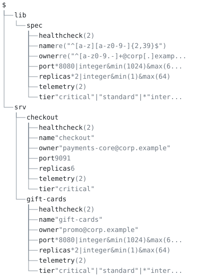

# 11. Shared truth across repos: distributing a schema package

**Scenario.** A platform team owns the service deployment contract for
`corp.example`. Application teams (here, the checkout team) validate
their service definitions against that contract *from another
repository*, and an agent working in the checkout repo can trust that
the contract it sees is the contract the platform team approved. The
case covers module identity (`corp.example/schemas/service`), the two
ways a package reaches a consumer (a copy by hand into
`aontu_meta/vendor/`, and `aontu sync` from a repository the platform
team publishes into), the three lock pins, `aontu pkg keygen`,
`aontu publish` and its compatibility gate, `aontu pkg serve`, the
cooldown, and a package that has `moved`.

Everything below was produced by the real CLI; `check.sh` re-runs all
of it (54 assertions) and exits 0. All output shown is verbatim with
ANSI codes stripped.



## Layout

```
platform/service/               the package as published (1.4.2)
platform/service-next-compat/   1.4.3 candidate (compatible widening)
platform/service-next-breaking/ 1.5.0 candidate (required key added)
platform/service2/              the same breaking change as a new package path
consumer/                       the checkout repo: pkg.aon, main.aon, gate.aon,
                                plus the committed aontu_meta/pkg-lock.aon and
                                aontu_meta/vendor/ tree exactly as `aontu sync`
                                left them
data/                           agent-emitted service candidates (JSON)
probes/refactor/                byte-different, meaning-identical module refactor
probes/transitive/              a package that depends on another package
probes/nested-ref/              a module with an internal $.-reference
expected/                       goldens (consumer output, tidy report, manifest)
```

Language features carrying the model: `close()` so consumers cannot
invent fields the platform does not operate; constraint atoms
(`re`, `min`, `max`) for field vocabularies; `*pref` defaults so a
two-line service definition renders a full deployment record; `k?:`
for the compatible-evolution probe; `hide()` to keep the imported
schema out of rendered output; module imports
`@"corp.example/schemas/service"` and the inline `#aon1-…` pinned form.

The module is written self-contained, with no `$.`-references between
its own top-level keys: `$` is the root of the importing document, so
a module imported at a nested consumer key cannot reach its own keys
that way (`probes/nested-ref/` shows the refusal).

## The model tree

`consumer/main.aon` is a consumer repository's entry: it imports the
platform team's module and writes its own services against it. `lib` is
what the module brought (the deployment spec, with its defaults and
bounds) and `srv` is what this repository owns.

```
$
├── lib
│   └── spec
│       ├── healthcheck (2)
│       ├── name re("^[a-z][a-z0-9-]{2,39}$")
│       ├── owner re("^[a-z0-9.-]+@corp[.]examp...
│       ├── port *8080|integer&min(1024)&max(6...
│       ├── replicas *2|integer&min(1)&max(64)
│       ├── telemetry (2)
│       └── tier "critical"|"standard"|*"inter...
└── srv
    ├── checkout
    │   ├── healthcheck (2)
    │   ├── name "checkout"
    │   ├── owner "payments-core@corp.example"
    │   ├── port 9091
    │   ├── replicas 6
    │   ├── telemetry (2)
    │   └── tier "critical"
    └── gift-cards
        ├── healthcheck (2)
        ├── name "gift-cards"
        ├── owner "promo@corp.example"
        ├── port *8080|integer&min(1024)&max(6...
        ├── replicas *2|integer&min(1)&max(64)
        ├── telemetry (2)
        └── tier "critical"|"standard"|*"inter...
```

`aontu view doc --depth 3 consumer/main.aon` draws it, and `check.sh` pins it
with `--out --check`. A key with `(n)` after it is a container the
depth bound stopped at, and `n` is how many keys are not drawn; a
leaf carries its canon, which is the kind of thing it is rather
than its value.

## The distribution flow

**1. Cold start.** The consumer declares
`dep: "corp.example/schemas/service": v: "1.4.2"` and has received
nothing. `aontu pkg tidy consumer/` exits 1:

```
verdict: missing
corp.example/schemas/service: not fetched (run: aontu sync)
```

and writes no lockfile rather than a partial one.

**2. Distribution is a copy, or a sync.** With no repository to
fetch from, the platform tree is copied by hand into the store layout
the resolver expects, `consumer/aontu_meta/vendor/corp.example/schemas/service/`:
path segments as directories, no major suffix. The layout is documented
in [`how-to/vendor-by-hand.md`](../../docs/how-to/vendor-by-hand.md).
With a repository (below), `aontu sync` does the copy itself,
and checks the publisher's proof, the archive's bytes and the module's
meaning before it does.

**3. `aontu sync` then pins.** Exit 0, and `aontu_meta/pkg-lock.aon` is
written as one canonical, diffable, JSON-parseable line:

<!-- fmt: keep a lock file, shown as the tool writes it -->
```aon
# pkg-lock.aon (generated by `aontu sync`; do not edit)
{"lock":{"corp.example/schemas/service":{"archive":"sha256:5b299a1256d890fbbe4062926ca8a9b4686c2907c75fb27963dca481809b7c1f","canon":"aon1-zFHnyVa1fA--g8hTx8lUUhaKzzRUNI--2nDheIMsSFs","v":"1.4.2"}}}
```

The `canon` pin equals `aontu hash platform/service/service.aon` to
the byte; `archive` is the digest of the tree's canonical archive, which
`aontu pkg manifest` prints. A package acquired from a repository
carries a third pin, `manifest`, the digest of what its publisher
signed; a hand-vendored one has no manifest, so it has no such pin.

**4. Evaluation resolves from `aontu_meta/vendor/`**, defaults fill, the
hidden schema stays out of the output, and two consecutive runs (JSON
and `--canon`) are byte-identical.

## What check.sh proves

**Hand distribution.**

1. Cold start, verify: on a consumer that has declared the dependency
   and received nothing, `aontu pkg verify` exits 1 and names the
   repair:

   ```
   verdict: unlocked
   corp.example/schemas/service: not in the lockfile (run: aontu sync)
   ```

   A project with no lockfile is not a verified one.
2. Cold start, tidy: `aontu pkg tidy` on the same consumer is
   `verdict: missing`, exit 1, names the package and the fix
   (`not fetched (run: aontu sync)`), and writes no lockfile.
3. After the platform tree is copied into `aontu_meta/vendor/`, `sync` is
   `verdict: ok`, fetches nothing, and the lockfile it writes is
   byte-identical to the committed `consumer/aontu_meta/pkg-lock.aon`.
4. `pkg tidy --format json` matches `expected/tidy.json` (canon and
   archive pins, `v`), the CLI version line aside.
5. `pkg vendor` leaves the already-vendored package in place,
   `verdict: ok`.

**Evaluation, hermetic.**

6. `aontu main.aon` matches `expected/consumer.json`: the consumer
   evaluates through `aontu_meta/vendor/`, `gift-cards` renders with the
   module's defaults (port 8080, replicas 2, tier `internal`, the
   healthcheck and telemetry blocks), and the hidden schema does not
   render.
7. Hermetic: two runs of the same inputs are byte-identical, as JSON
   and as `--canon`.
8. `aontu hash platform/service/service.aon` equals the lockfile's
   canon pin.
9. `hash --form` shows the hashed text includes the `close({…})`
   wrapper: closedness, invisible in plain canon, is inside the pin.

**Integrity.**

10. Tamper: flipping the vendored default `*8080` to `*9090` fails
    evaluation (exit 1) with both hashes named:

    ```
    module integrity: corp.example/schemas/service expected aon1-zFHnyVa1fA--g8hTx8lUUhaKzzRUNI--2nDheIMsSFs got aon1-NHmNT6r-Lhy8di9BgGNRfgwNFT3r5PgCZxCYnJ4F0Ws
    ```
11. `pkg verify` against the tampered store checks bytes before
    meaning, so it is the archive pin that speaks; it writes nothing,
    and `aontu_meta/pkg-lock.aon` is byte-identical afterwards:

    ```
    $ aontu pkg verify
    verdict: mismatch
    corp.example/schemas/service: pinned archive sha256:5b299a… but the store holds sha256:…
    $ echo $?
    1
    ```

    This is the check a CI job runs before it evaluates.
12. `sync --frozen` is the same gate with the fetch step: against the
    tampered store it is `verdict: frozen`, names
    `lockfile would change: corp.example/schemas/service: repinned`, and
    leaves the lockfile untouched.
13. `pkg tidy` run after the same tamper reports `verdict: ok` and
    re-pins the lockfile to the tampered hash. `tidy` trusts the store,
    and rewriting the lockfile is its job, which is why CI runs
    `verify` or `sync --frozen` and the committed lockfile's diffs are
    read like code.
14. Refactor: replacing the vendored `service.aon` with the two files
    in `probes/refactor/` (an entry delegating to a reordered,
    re-commented `schema.aon`) gives new bytes and a new file count,
    and after re-sync the canon pin is back to `aon1-zFHnyVa1…` with
    the rendered output unchanged, while the archive pin moves. The
    canon pin hashes the module's meaning; the archive pin, its bytes.

**The inline pin.**

15. Inline pin: a single file with
    `@"corp.example/schemas/service#aon1-zFHn…"`, no `pkg.aon` and
    no lockfile, resolves and verifies: `model get '$.svc.spec.port'`
    answers `8080`.
16. A mangled inline pin is refused with the same `module integrity:`
    error, exit 1.
17. A bare file reference, `@"config.json"`, is refused with the
    repair: `local files need a ./ prefix`. Nothing routes it anywhere.

**Cache resolution against a trust root.**

18. User cache: with the package present only in the user cache under
    its `(canon-hash, package path)` key, and a lockfile but no vendor
    tree, default trust evaluates to the same output as the vendored
    run.
19. `--trust root:<projectdir>` on that project fails with
    `module not fetched: corp.example/schemas/service`: the cache is
    outside the confinement boundary.
20. `pkg vendor` copies cache → `aontu_meta/vendor/`, and the confined
    evaluation then passes with the same output.
21. The cache is consulted only once a pin is known: with the cache
    seeded but no lockfile, `pkg tidy` is still `verdict: missing`.
    `sync` fetches; `tidy` does not.
22. `sync --trust root` refuses with exit 2: the verb reads and writes
    the user cache, which a confinement root does not reach.

**The publish boundary.**

23. `pkg manifest platform/service` matches `expected/manifest-142.txt`:
    the signed manifest a publish sends (the archive digest and size,
    the module's entry and canon-hash, every file with its digest).
    `aontu_meta/` is not part of the archive.
24. Publish gate, compatible: `pkg manifest --against platform/service
    platform/service-next-compat` (1.4.3: replicas ceiling widened,
    optional `runbook?:` added) is `verdict: ok`.
25. Publish gate, breaking: `platform/service-next-breaking` (a
    "minor" 1.5.0 that adds a required `oncall` field) exits 1 and
    names the key it refuses on; no version number lifts the gate:

    ```
    verdict: breaking
    ...
    $.spec.oncall: the general value requires this key; the specific value admits instances without it
    ```
26. The identical breaking schema as `platform/service2`, a new package
    path at 1.0.0, is `verdict: ok`: a new path has no predecessor to
    gate against, and no consumer of the old path sees it unasked.

**A repository, served and synced.**

27. `pkg keygen` mints an Ed25519 key once and prints its signer id
    (`signer: ed25519:…`); a second `keygen` at the same file refuses
    with `written once`, exit 2.
28. `publish --key … --to repo platform/service` without `--yes` is
    `verdict: dry-run`: every check runs, the signer is named, the
    report ends `dry run: nothing sent (add --yes)`, and the repository
    directory is untouched.
29. `publish --yes … --to repo` writes the read-path layout:
    `pkg/corp.example/schemas/service/@v/{1.4.2.zip,1.4.2.manifest,1.4.2.sig,list}`,
    `@latest`, and `advisory/corp.example/schemas/service.aon`.
30. Publishing 1.4.3 reports `against: corp.example/schemas/service 1.4.2`:
    the gate runs against the newest version the repository holds.
31. Publishing 1.5.0 is `verdict: breaking`, exit 1, and writes nothing
    into the repository.
32. Publishing 1.4.3 again is `refused: version_exists`: a version is
    never reusable.
33. `pkg serve --listen 127.0.0.1:0 repo` serves the directory on a
    loopback address and prints `serving <dir> at http://127.0.0.1:<port>`.
34. A consumer whose `pkg.aon` names that base and the signer
    (`repo: { base: [...], trust: { "corp.example/*": { signer: "ed25519:…", inclusion: none } } }`)
    syncs from a fresh cache: `fetched: corp.example/schemas/service 1.4.2`,
    the lock entry carries a `manifest` pin, the vendored tree keeps
    `aontu_meta/manifest.aon` and `aontu_meta/proof.aon` beside it, and
    the acquired package evaluates byte-identically to the hand-vendored
    one.
35. A second `sync` fetches nothing, and `sync --frozen` holds.
36. `why corp.example/schemas/service` answers
    `corp.example/checkout -> corp.example/schemas/service`.
37. `pkg outdated` reports the package `current` and a
    `cooldown_pending:` event: 1.4.3 was published minutes ago and is
    not selectable by default for seventy-two hours.
38. `get corp.example/schemas/service@1.4.3` reports
    `change: raised corp.example/schemas/service 1.4.2 -> 1.4.3`,
    fetches it, and edits `pkg.aon`: a version named explicitly skips
    the cooldown.
39. `get corp.example/schemas/service` without a version is
    `refused: cooldown_pending`, exit 1, naming when the hold lifts.
40. `add corp.example/schemas/service` on a project that already
    declares it refuses with exit 2, `already a dependency`, and names
    `get`.
41. `remove corp.example/schemas/service` reports
    `change: removed …` and drops the dependency, its lock entry and
    its vendor tree.
42. A consumer whose trust entry names a different signer is
    `refused: proof_signer_untrusted` before a byte of the archive is
    read; nothing is vendored.
43. A byte appended to the served `1.4.2.zip` is
    `refused: archive_digest_mismatch`: the digest is checked before
    the archive is parsed.
44. A move: 1.4.4 of the old path declares
    `moved: "corp.example/schemas/service2"`; its manifest carries
    `moved:`; a fresh sync of the old path is `refused: module_moved`
    with `moved to corp.example/schemas/service2; import that instead`;
    and a further publish to the old path is `refused: path_moved`.

**Vetting agent candidates through the module.**

45. `vet --at spec gate.aon data/checkout-good.json` is
    `verdict: valid`.
46. `data/rogue-sidecar.json` is `verdict: invalid`, with located
    `[aontu/constraint]` findings for the bad name and the
    non-corporate owner and an `[aontu/closed]` finding for the
    invented `sidecar` key.

**Transitive dependencies.**

47. Minimum version selection (`probes/transitive/`): the consumer asks
    `common` at 1.0.0, `service` asks 1.2.0, and `sync` selects 1.2.0,
    the highest of the declared minima. Held packages are read before
    anything is fetched, so the vendored `common` at 1.2.0 satisfies
    the raised bid and no request goes out.
48. The flat tree `sync` writes is the layout a nested import reads:
    resolution tries every enclosing `pkg.aon` root, nearest first, so
    `common` vendored beside `service` is found and the consumer
    evaluates.
49. `why corp.example/schemas/common` lists every chain that reaches
    it: `corp.example/checkout -> corp.example/schemas/common` and
    `corp.example/checkout -> corp.example/schemas/service -> corp.example/schemas/common`.
50. The pin `sync` locks for the dep-bearing module equals what
    `aontu hash` computes for the same file.
51. A module that does not evaluate on its own is not pinned. With
    `service` vendored but `common` absent, `tidy` refuses and writes
    no lockfile:

    ```
    $ aontu pkg tidy
    verdict: error
    corp.example/schemas/service: does not evaluate on its own; nothing to pin
    corp.example/schemas/common: not fetched (run: aontu sync)
    $ echo $?
    4
    ```
52. Module-internal references: `probes/nested-ref/`
    (`spec: { port: $.defaults.port }`) hashes standalone, and imported
    at a nested consumer key it is refused with `[aontu/no_path]`,
    because `$` is the root of the importing document.

**Version bookkeeping.**

53. A vendored tree whose own `pkg.aon` says `1.4.2` does not satisfy a
    declared `9.9.9`: `sync` reaches for the repository and, with none
    configured, is `refused: fetch_failed`. The version a tree declares
    is the version it is taken at.

**The model tree.**

54. `view doc --depth 3 consumer/main.aon` draws the figure at the head
    of this page, and `--out --check` pins it, as text and as SVG.

## Run

```
./check.sh          # 54 assertions, exits 0
```

`check.sh` uses a private `XDG_CACHE_HOME`, never touches the real
user cache, starts `pkg serve` on a port the OS chooses and stops it
when done, and runs from any cwd. `AONTU` may be overridden to point
at another build.
