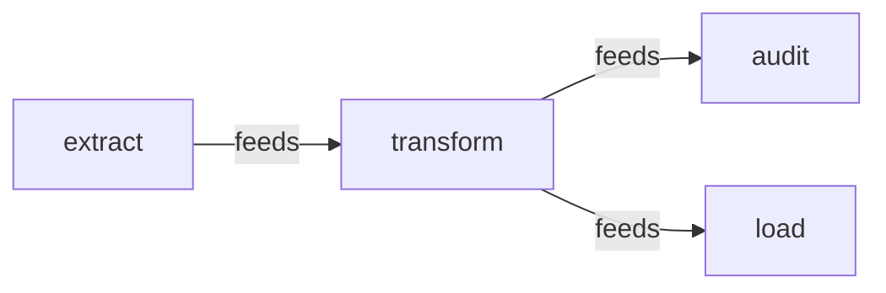
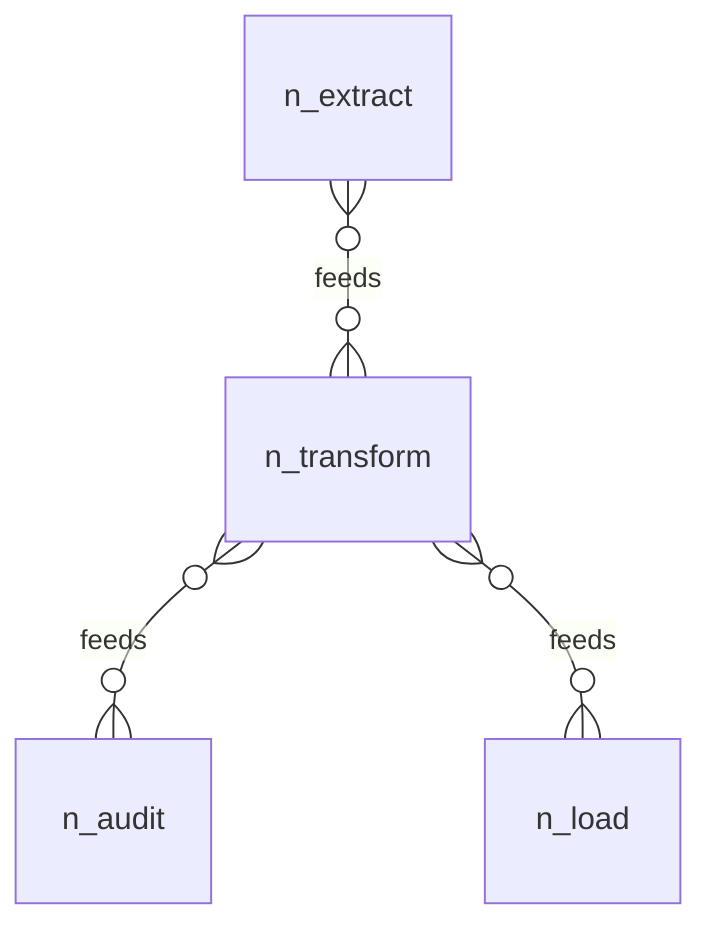

# 12 — relations: a pipeline DAG, declared once, enforced at generation

## The pipeline, drawn

Both diagrams below are generated from this model by
[`../tools/diagram.js`](../tools/diagram.js), which reads `graphOf` and
nothing else, and both are pinned as goldens by `check.sh`. There is no
`aontu view` verb yet — see
[`docs/design/VIEWS.0.md`](../../docs/design/VIEWS.0.md).

**Six written edges, three logical ones.** `graphOf` reports every
written position, and `feeds` is declared `inverse(fedBy)` with both
directions written out, so the raw edge set doubles every relation that
has an inverse. The renderer collapses each unordered pair. Which
direction survives is chosen by `--primary feeds`: without it the
code-point-least key wins and the pipeline reads backwards. The proper
rule — draw the **declaring** direction — needs the relation
declarations, and `relation.ts` exports findings rather than
declarations. That is a gap the view design has to close.

The same edges as an entity-relationship diagram:

Cardinality is drawn many-to-many throughout because the model does not
state one. Drawing a cardinality the model does not assert would be an
invention.

The dedicated exercise of the field-declared relation surface
(docs/design/RELATIONS.0.md, landed 2026-08-29). Use-case 01 grew its
relations incidentally, magic-key era included; this model was born on
the atoms, so it shows the shape with nothing else in the frame.

## The model

An ETL pipeline: four jobs, each addressed by its tree path, and
one relation — `feeds`, with its written-out inverse `fedBy`. The
WHOLE declaration is one line of schema (spec.aon):

    feeds?: rel($.spec.JobShape) & re("^job_") & acyclic() & inverse(fedBy)

- `rel(t)` — the field's strings are checked entity addresses, and
  `t` flows into every target (the old `target:` declaration, now the
  engine's own meet).
- `re("^job_")` — a held constraint, applied to EVERY address leaf.
- `acyclic()`, `inverse(fedBy)` — the graph atoms: lattice-inert
  declarations, registered during unification, DECIDED at generation,
  where every edge is known.

The data (pipeline.aon) is then plain JSON-shaped lists — no
`[&: refer(), …]` boilerplate, no `relations:` root key (that key is
ordinary user data now; ADR-010's grandfather clause is discharged).

## What check.sh proves

1. The good model generates, links as plain strings; the verb passes.
2. Canon renders the declarations reparseably at the field.
3. A cycle refuses AT GENERATION with a located `relation_cycle`
   naming the loop; the verb reports the same finding.
4. A missing inverse refuses the same way, naming the exact entry.
5. A wrong-kind endpoint is `rel(t)`'s flow refusing at EVALUATION —
   an ordinary located conflict, and `verdict: error` from the verb.
6. A dangling address refuses inside the evaluation
   (`rel_unresolved`): existence is decided, never deferred.
7. An append from a separate position (proposals/append.aon) converts
   like the originals — the rewrite installs its leaf constraint as
   the list's element spread — and the relations still hold.
8. `aontu reaches --relation feeds` answers the closure question
   directionally over the same edges.

## Boundaries hit while writing it

- A `rel(t)` whose `t` references a sibling of its OWN schema bag
  deadlocks (BUGS.md §53) — the endpoint shapes live in their own
  `shape:` bag here. The self-typed form (`rel($.spec.Job)` inside
  `Job`) waits on docs/design/RECURSION.0.md the same way.
- Lists unify positionally, so the append restates existing elements
  verbatim (use-case 01 records the same workaround).
