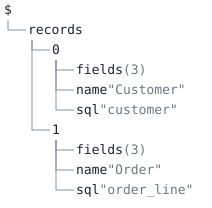

# 15 — code generation

**One model, three generated files, each over a different slice of it.**
Go structs, TypeScript interfaces and SQL DDL — every file is computed
by the unifier from [`model.aon`](model.aon) and nothing else. Each
transform's `$.file` is the whole artifact, one string. `check.sh` reads
it with `aontu get '$.file'`, puts a `DO NOT EDIT` banner in front of
it, and writes bytes; nothing outside the model decides layout,
ordering or separators.



## What is generated

| transform | reads | writes | golden |
|---|---|---|---|
| [`gen-go.aon`](gen-go.aon) | `name`, `fields.n`, `fields.t`, `fields.go` | Go structs with JSON tags | [`expected/types.go`](expected/types.go) |
| [`gen-ts.aon`](gen-ts.aon) | `name`, `fields.n`, `fields.t`, `fields.req` | TypeScript interfaces | [`expected/types.ts`](expected/types.ts) |
| [`gen-sql.aon`](gen-sql.aon) | `sql`, `fields.sql`, `fields.t`, `fields.req` | `CREATE TABLE` statements | [`expected/schema.sql`](expected/schema.sql) |

The Go emitter never reads `sql`; the SQL emitter never reads `go`;
the TypeScript emitter reads neither and keeps the wire name in `n`.
The SQL emitter quotes every identifier, because `order` is a reserved
word and a generator that emits it bare produces a file that does not
parse — always quoting is simpler than carrying a word list.

## The model tree

`model.aon` is the whole input to the generators: a list of records,
each with a name, a SQL table name and its fields. Everything the Go,
TypeScript and SQL targets emit is rendered from these three keys, so
the model tree is also the list of things a target must handle.

```
$
└── records
    ├── 0
    │   ├── fields (3)
    │   ├── name "Customer"
    │   └── sql "customer"
    └── 1
        ├── fields (3)
        ├── name "Order"
        └── sql "order_line"
```

`aontu view doc --depth 3 model.aon` draws it, and `check.sh` pins it
with `--out --check`. A key with `(n)` after it is a container the
depth bound stopped at, and `n` is how many keys are not drawn; a
leaf carries its canon, which is the kind of thing it is rather
than its value.

## The shape of a transform

```aon
units: [&: {
  head: `type ` + .name + ` struct {`
  rows: [&: { out: `\t` + .go + ` ` + match(.t, "string", `string`, …) }] & .fields
  body: join(pick(.rows, out), `\n`)
  tail: `}`
  text: .head + `\n` + .body + `\n` + .tail
}] & $.records

file: join(pick($.units, text), `\n\n`) + `\n`
```

Each line of that shape is a decision:

- **A list spread, not `pack`.** List order is *source* order. `pack`
  keys by data and map keys sort by code point, so `pack`-then-`pick`
  emits the records alphabetically — silently wrong output for a file.
- **Backtick strings carry the target text.** They span lines and
  process escapes, so `\t` and an escaped backtick both work (see
  [Lexical structure](../../docs/reference-language.md#lexical-structure)
  in the language reference).
- **The rows are staged into a key of their own.** `pick` projects
  from a settled sibling, so the per-field lines are built in `rows`
  and projected from there. The key rides along in the evaluated
  value; `$.file` never reads it.
- **`join` folds twice, at two scales.** Once over a record's column
  lines and once over the records themselves, with a different
  separator each time. That is the whole of file assembly, and it is
  why there is no `lines` and no `concat`: a separator argument covers
  both, and `join(coll)` with none is concatenation.
- **Names come from the model, not the emitter.** `Email` and
  `credit_cents` are written in `model.aon` rather than computed:
  `upper()` uppercases a whole string, so the target's spelling belongs
  in the model. What a type is *called* in a target is a fact about
  the model, not a rule in a template — the "symbol provider" split
  that code generators arrive at. Writing the name down also makes a
  collision a unification conflict rather than a broken identifier at
  emit time.

`gen-sql.aon` folds the column lines with `,\n`, so the separator
falls between them and the last column carries no trailing comma:

```sql
CREATE TABLE "customer" (
  "id" TEXT NOT NULL,
  "email" TEXT,
  "credit_cents" BIGINT
);
```

## What check.sh proves

A generator whose output merely looks right is a generator nobody
trusts, so the checks compile the Go and parse the SQL rather than
inspecting them.

1. Each transform evaluates to one string: two units separated by one
   blank line, five lines each (head, three columns, tail), and no
   trailing separator.
2. The three generated files match `expected/types.go`,
   `expected/types.ts` and `expected/schema.sql` byte for byte, each
   behind its `Code generated by aontu from model.aon. DO NOT EDIT.` banner.
3. The generated Go compiles: `go build` in a scratch module.
4. `gofmt` reformats the output, aligning the struct tags: the
   generator's job is correct code, and layout is the formatter's.
5. The generated SQL parses: SQLite executes it, the tables `customer`
   and `order_line` exist, `order_line` has exactly the columns `id`,
   `customer_id` and `total_cents`, and no column list ends in a comma.
6. The slices are real: renaming a `go` field (`Email` to `EmailAddr`)
   in a copy of the model moves the Go output and leaves the
   TypeScript output byte-identical.
7. Generation is deterministic: two runs of the same transform are
   byte-identical.
8. The Go port emits the same bytes as the TypeScript engine for all
   three targets (ADR-001): one model never becomes two different
   files depending on which engine ran.

Checks 3, 4 and 8 need a Go toolchain and skip with a note when none
is present.

## Run

```sh
./check.sh          # eight checks, including both ports byte for byte
```
